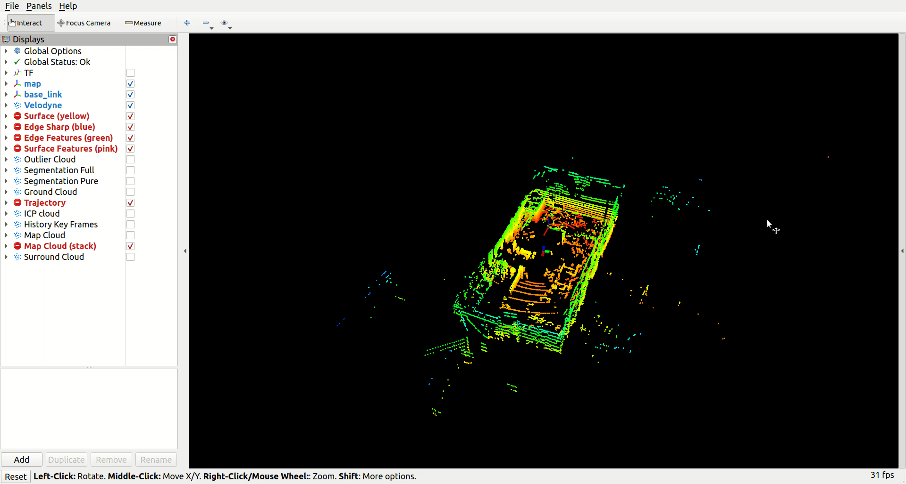
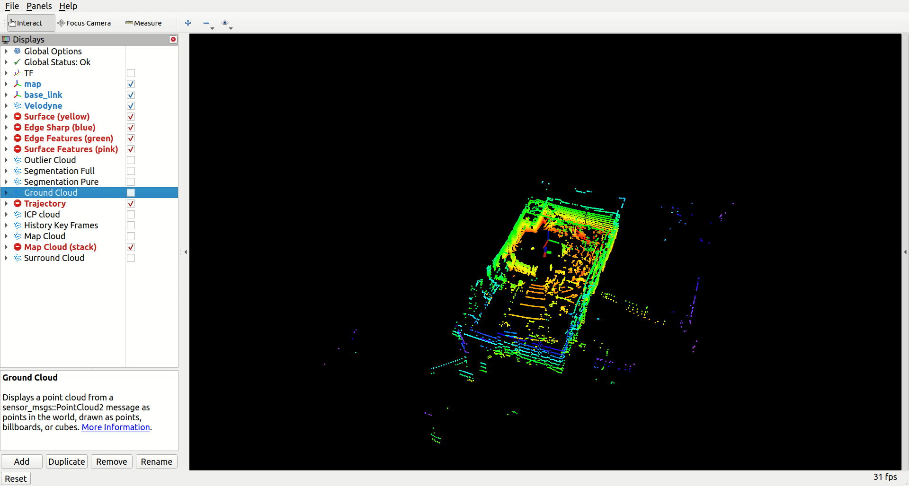
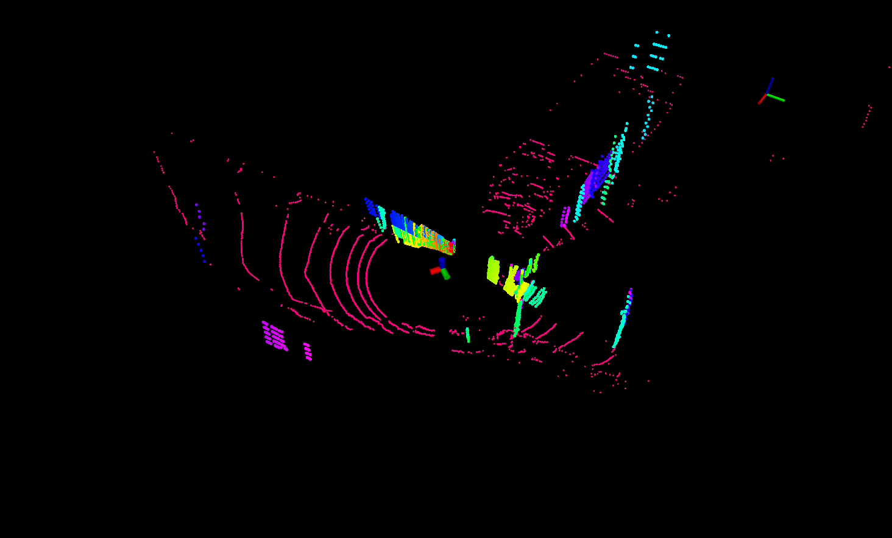
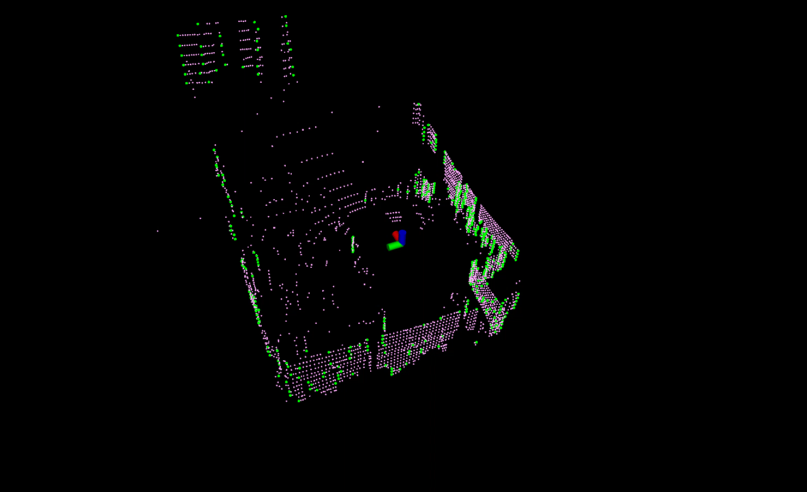
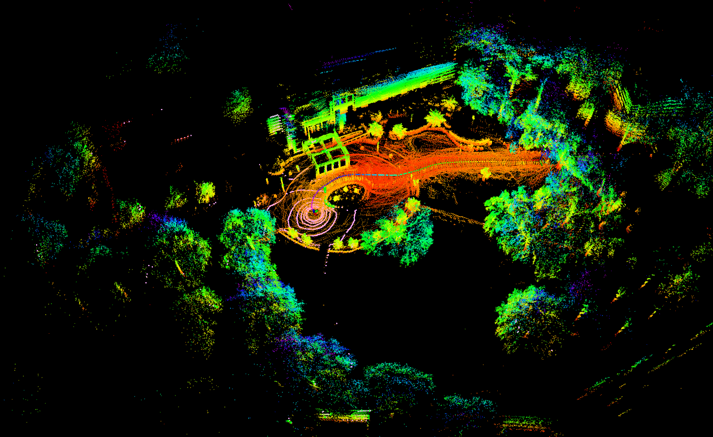

## 安装

本机环境Ubuntu20.04 + ROS noetic

github：https://github.com/RobustFieldAutonomyLab/LeGO-LOAM

1. 安装gstam
2. 编译安装，此处报错opencv版本不对，我安装的opencv是4.2.0，参考https://blog.csdn.net/weixin_44156680/article/details/118070387

> /home/eureka/code/legoloam_ws/src/LeGO-LOAM/LeGO-LOAM/include/utility.h:13:10: fatal error: opencv/cv.h: 没有那个文件或目录

找到该处修改为：`#include <opencv2/imgproc.hpp>`

> pcl问题

其他的我不写了，总之是碰到了参考博客提到的前三点问题。

在运行下面测试中的第一个命令报错`[mapOptmization-7] process has died`解决方法是：

```bash
sudo apt-get install libparmetis-dev
```

> 在实验中，会发现有一部分数据话题是error的

找到教程将所有代码中的`/camera`开头的改为`camera`即可，推测原因是tf版本1和2的区别。

## 测试

### 实验一

按照官网的命令，我们使用`nsh_indoor_outdoor.bag`进行测试。命令如下：

~~~bash
roslaunch lego_loam  run.launch 
rosbag play ~/bags/nsh_indoor_outdoor.bag --clock --topic /velodyne_points /imu/data
~~~

不带有`imu`数据的情况



带有imu数据的情况




红色表示地面点云，彩色的表示分割去噪后保留的点云。



蓝色和黄色表示明显的边缘点和面点特征。


绿色和粉色表示所有的边缘点和面点特征。



可以观察到最终结果没有太大区别，推测原因：数据集时间较短，还没有出现足够的误差。

但在一开始的时候带有imu数据的测试构建的地图就比较稳定。

我们要第一步要做到的是仅在LiDAR数据下进行仿真实验，目前效果已经良好。

### 实验二

使用该项目中提供的数据集https://github.com/TixiaoShan/Stevens-VLP16-Dataset?tab=readme-ov-file




