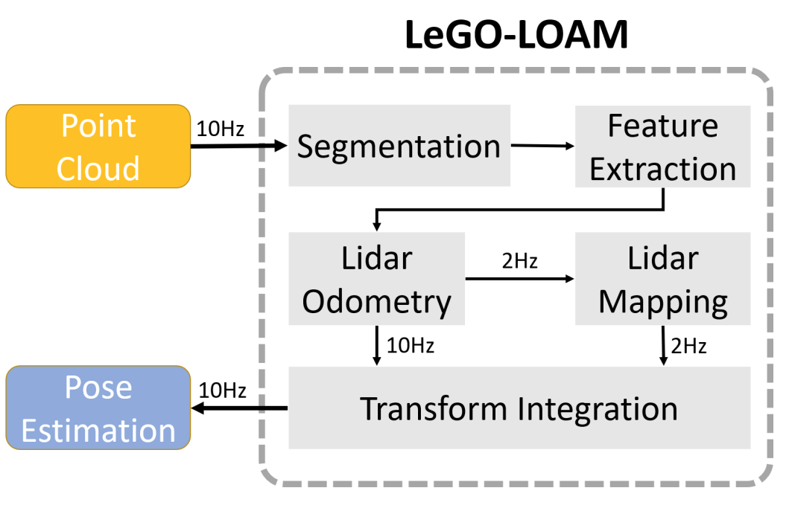
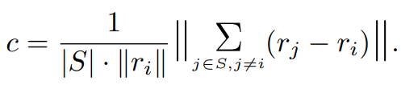
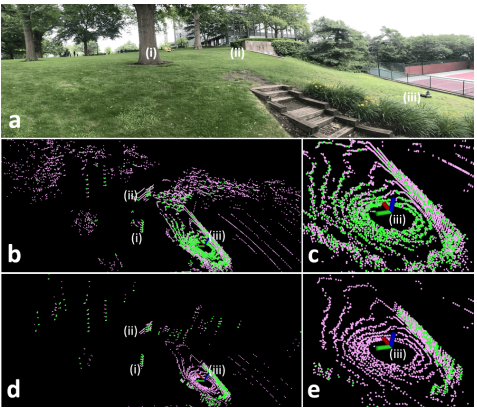
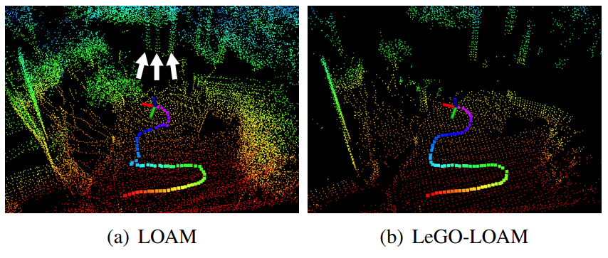
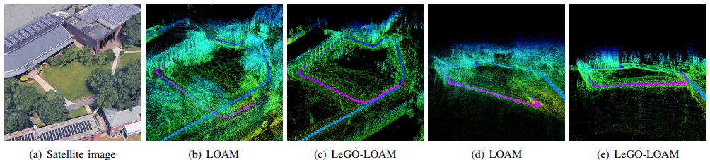
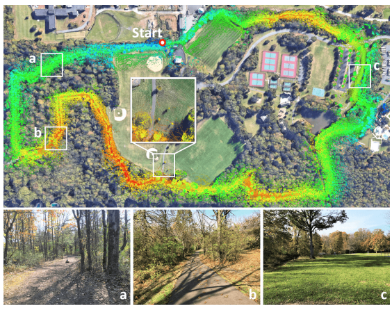
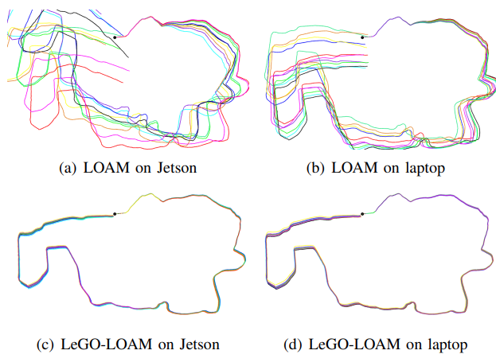
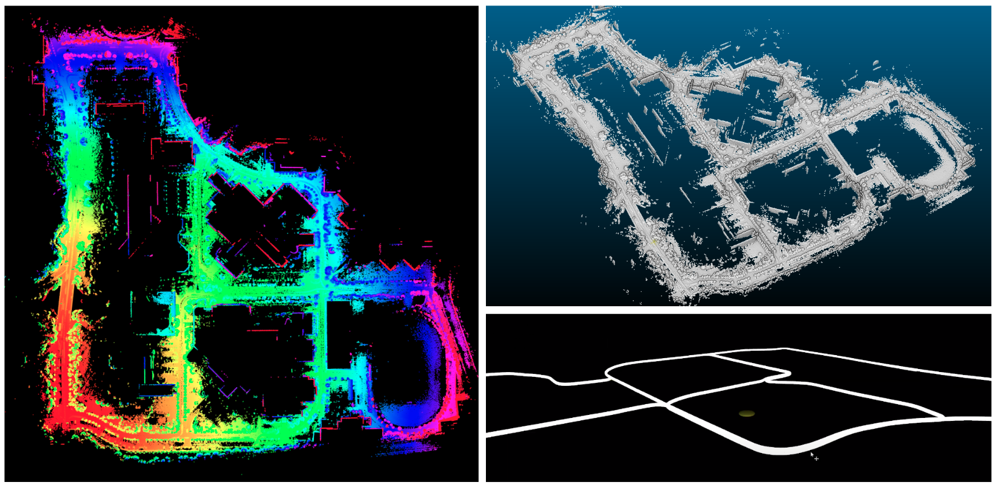

参考

https://blog.csdn.net/gwplovekimi/article/details/119711762

https://zhuanlan.zhihu.com/p/426478348

https://zhuanlan.zhihu.com/p/157533731

https://github.com/hku-mars/loam_livox 多机雷达建图

## LeGO-LOAM笔记

### LOAM算法的问题

作者的实验平台是一个移动小车（UGV），挂载了一个Velodyne VLP-16 线激光雷达，还配有一个低精度的 [IMU](https://zhida.zhihu.com/search?content_id=182903053&content_type=Article&match_order=1&q=IMU&zhida_source=entity)；选用的硬件平台是 [Nvidia Jetson TX2](https://zhida.zhihu.com/search?content_id=182903053&content_type=Article&match_order=1&q=Nvidia+Jetson+TX2&zhida_source=entity)（ARM Cortex-A57 CPU）；整体负载是 20Kg；移动速度为：2.0m/s；测试场景为：**地面不平（比较颠簸）的草地**。

LOAM框架在这样的硬件环境和使用场景中会存在一些问题：

1. 由于搭载的是嵌入式系统，**计算能力受限**，LOAM的计算需要将难以满足，致使无法做到实时；
2. **数据量过大**，计算频率跟不上传感器更新频率。如果使用LOAM框架，系统计算每个点曲率的处理频率（数据量很大，VLP-16一条线是1800个点）将难以跟上传感器的更新频率；
3. UGV行驶的**路面是非平滑连续**的（运动是颠簸的），采集的数据将会失真（运动畸变，匀速运动模型无法适用于颠簸场景），使用LOAM很难在两帧之间找到可靠的特征对应。
4. **环境噪声影响**。在噪杂的环境中操作UGV也会给LOAM带来一些挑战，例如：浮动的草丛和摆动的树叶的点云将被误提取为角点或面点，这些特征是不可靠的，难以在连续帧之间获取准确的匹配，从而会造成较大的漂移。

### 系统架构

整个软件系统分为 5 个部分：

- **第一部分：Segmentation：** 这一部分的主要操作是分离出地面点云；同时对剩下的点云进行聚类，滤除数量较少的点云簇。
- **第二部分：Feature Extraction：** 对分割后的点云（已经分离出地面点云）进行边缘点和面点特征提取，这一步和LOAM里面的操作一样。
- **第三部分：Lidar 里程计：** 在连续帧之间进行（边缘点和面点）特征匹配找到连续帧之间的位姿变换矩阵。
- **第四部分：Lidar Mapping：** 对feature进一步处理，然后在全局的 point cloud map 中进行配准。
- **第五部分：Transform Integration：** Transform Integration 融合了来自 Lidar Odometry 和 Lidar Mapping 的 pose estimation 进行输出最终的 pose estimate。

### 语义分割

也就是Segmentation

1. 将t时刻扫描得到的点云视为P_t，将其投射为一个**深度图（range image）**，其中的点一一对应，像素值表示深度值。
2. 对深度图的**柱状评价（column-wise evaluation）**可以视作对地面的估计，从而实现对**地面的提取**。
3. 对剩余的深度图进行**聚类**，过滤掉点云数量较少（少于30）的点云簇，再对剩余的点云簇分配不同的**标签**。这样可以排除掉类似树叶这种不可靠的特征。地面点云属于特殊的一种点云簇。
4. 此时每个点具备三种属性：1>对应所在点云簇的标签。2>在深度图中的位置。3>深度值。

### 特征提取

与LOAM中操作一致，主要是从地面点云和聚类点云中提取边缘点edge feature和面点planar feature。

首先计算每个点的曲率：

根据阈值找出所有并不明显的边缘点和面点，其中只有面点才需要从地面点云中提取。然后在从中提取明显的边缘点和面点。

### 激光雷达里程计

估计传感器在连续两帧间的位姿，与LOAM中类似。

1. 标签匹配：只有具有同一标签的点云簇中的点才可以进行匹配。
2. 两步L-M优化：LOAM的实现中采用直接LM求得最短距离下的位姿矩阵；而在LeGO-LOAM中，应用两步LM求得位姿矩阵：
   1. 先利用面点特征进行匹配
   2. 再利用边缘点特征进行匹配
   3. 融合两次匹配结果得到位姿变换矩阵。时间消耗降低35%

### 激光雷达建图

这一部分执行低频高精度的配准。

1. 把当前的点云特征于周围的点云图进行匹配进一步改善位姿变换
2. 再次使用LM方法获取最终变换结果。

与LOAM的区别在于点云图的储存：LeGO-LOAM放弃单张点云图的储存，转而储存单个特征集，每个特征集与位姿进行绑定

### 性能表现

1. 在小场景的激烈运动过程中：LOAM 会把草丛、树叶提取为边缘点特征（草丛和树叶是不稳定特征的主要来源）；而LeGOU-LOAM会过滤掉这些不稳定的特征，只会在树干，地面，台阶等上提取稳定特征。
   
2. 在LOAM框架中，剧烈的运动容易造成点云地图的发散，如下图中(a)LOAM，有三个树干。
   
3. LOAM 在人行道上的建图效果并不好，可能是一端存在树木叶子的干扰
   
4. 在其他三种场景中，LeGO-LOAM的偏差(终点相对于初始位置的偏差)表现都要优于LOAM
   
5. LeGOLOAM可以用更少的计算时间实现可比或更好的位置估计精度。

## 其他算法

1. LOAM： 我们选择直接在LeGO-LOAM的基础上进行开发，因为各个方面都要好。

2. LIO-SAM：是LeGO-LOAM的扩展版，添加了IMU预积分因子和GPS因子。我们目前初步要实现的是激光雷达定位和建图，这一部分可以在之后优化时考虑。

3. SC-LIO-SAM：在LIO-SAM的基础上把回环检测改为Scan Context
   

4. LVI-SAM：基于图优化的多传感器融合框架，结合了LIO-SAM和Vins-Mono，具有多个子系统：视觉惯性子系统和雷达惯性子系统和单目雷达惯性融合。任一一个子系统失效时整个系统还能运行，具有鲁棒性。
   

5. LOAM_livox：基于固态激光雷达

   - 机械雷达：通过机械方式改变扫描方向；类似于一个激光笔，放在电机上旋转；十六线雷达，就是依次改变扫描的角度和高度，进行旋转。

   - 固态雷达：通过阵列干涉改变扫描方向。类似于一个激光笔自己不动，改变激光射出的方向和角度。

   