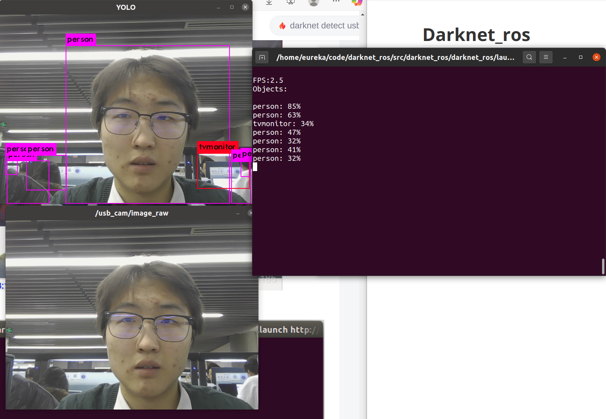
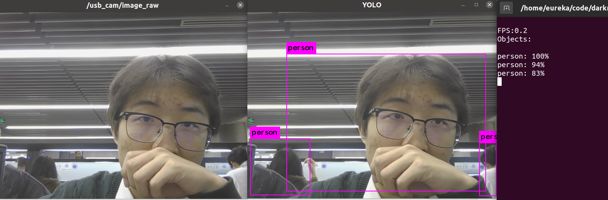

# Darknet_ros

https://github.com/leggedrobotics/darknet_ros

# 安装

参考https://github.com/leggedrobotics/darknet_ros
https://blog.csdn.net/qq_42145185/article/details/105730256

1. 在工作目录下的`src`路径下clone
   ~~~bash
   git clone --recursive git@github.com:leggedrobotics/darknet_ros.git
   ~~~

2. 编译
   ~~~bash
   catkin_make -DCMAKE_BUILD_TYPE=Release
   ~~~

   如果没有下载需要的模型文件的话，在编译过程中就会开始下载，比较耗时。

3. 运行
   首先是运行摄像头节点获取图像数据，也可以自行发布图像数据。

   ~~~bash
   sudo apt install ros-noetic-usb-cam
   ~~~

   运行摄像头节点
   ~~~bash
   roslaunch usb_cam usb_cam-test.launch 
   ~~~

   其次，修改darknet_ros的订阅话题`darknet_ros/config/ros.yaml`，将其中订阅的话题修改为摄像头发布的话题。

   运行yolo命令

   ~~~bash
   roslaunch darknet_ros darknet_ros.launch
   ~~~

   这个是yolo-v2-tiny模型下的效果
   

   这是yolo-v3下的效果
   