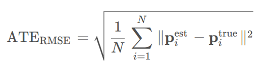

## 评价指标

**ATE**和**RPE**是两种常用的精度评价指标，它们分别代表了绝对轨迹误差(Absolute Trajectory Error)和相对姿态误差(Relative Pose Error)

### 1.绝对轨迹误差

定义：ATE度量的是估计轨迹与真实轨迹之间的全局偏差。具体来说，它是通过计算每一帧估计位姿（由SLAM算法得到）与真实位姿之间的三维空间距离（通常是欧氏距离），然后对所有帧的这种距离取平均或均方根误差(RMSE)来得到的。ATE提供了关于整个轨迹估计质量的综合视图，适用于评估SLAM系统在长时间运行后的累计误差。

公式：对于整个轨迹上的N个时刻，ATE的均方根误差可以表示为：



### 2.相对姿态误差

**定义：** **RPE** 关注的是相邻帧间姿态变化的误差，用来评估系统随时间的漂移量。它测量的是连续帧之间估计姿态变换与真实姿态变换之间的差异。RPE特别适合用来评估视觉里程计系统（**VO**）的性能，因为它能够揭示系统在短时间尺度上的稳定性，比如每秒的漂移量。

**计算公式：**对于两帧之间的相对姿态误差，可以定义为：


其中，T代表位姿变换矩阵，log(.)表示李代数上的对数映射。


## 工具 EVO

**安装**：

```bash
pip install evo --upgrade --no-binary evo
```

