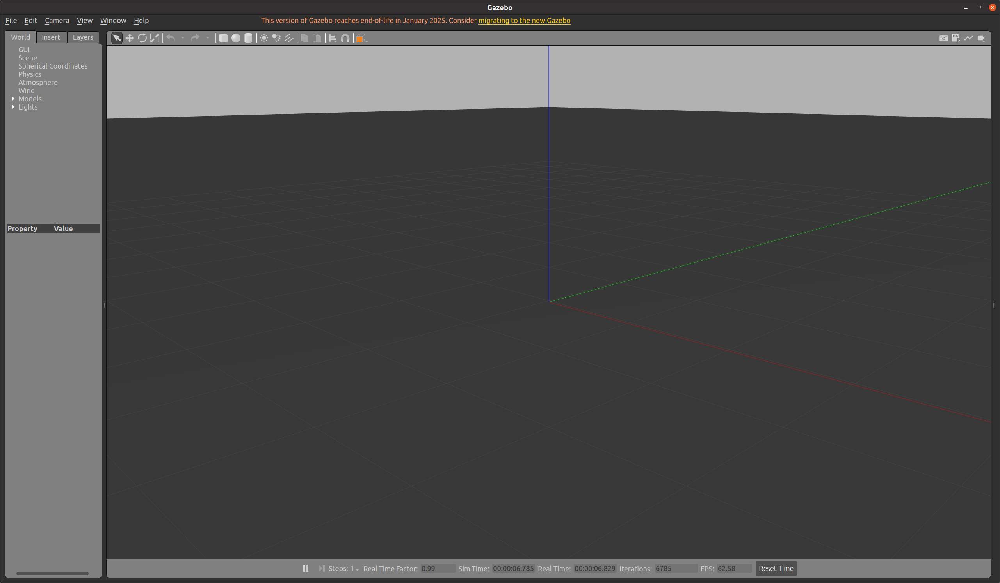

参考https://gazebosim.org/home

https://blog.csdn.net/Jenniehubby/article/details/134780066

https://gaoyichao.com/Xiaotu/

录制数据
```bash
rosbag record /velodyne_points /tf /tf_static /clock
```

操控小车
~~~bash
rosrun teleop_twist_keyboard teleop_twist_keyboard.py
~~~

启动仿真
~~~bash
roslaunch lidar_car_pkg lidar_car.launch
~~~

启动识别
```bash
roslaunch openpcdet 3d_object_detector.launch 
```

启动算法

```bash
roslaunch lego_loam run.launch
```


# 安装

1. 由于我下载的ROS已经自带了gazebo了，故不用再下载，输入`gazebo`命令，可以启动gazebo。



2. 安装模型库
   前往`~/.gazebo`文件夹下clone 模型库，使用`Ctrl+H`快捷键显示被隐藏的文件夹。
   在该文件夹下使用`git clone https://github.com/osrf/gazebo_models.git`.内容较多，下载比较耗时。

3. 加载模型到gazebo中
   我采用了参考博客中的方法一，直接将全部模型导入到gazebo

   ~~~bash
   sudo cp -r ~/.gazebo/gazebo_models/* /usr/share/gazebo-11/models
   ~~~


# 使用

参考https://blog.csdn.net/lc1852109/article/details/126082238

https://blog.csdn.net/lc1852109/category_11946504.html

1. 使用插件代码进行 代码中速度设置、world文件中标签设置速度、ros发布话题设置速度。
   https://gaoyichao.com/Xiaotu/?book=ros&title=Gazebo%E7%9A%84%E4%BB%BF%E7%9C%9F%E6%8F%92%E4%BB%B6

2. 使用ROS启动gazebo仿真
   https://gaoyichao.com/Xiaotu/?book=ros&title=%E9%80%9A%E8%BF%87ROS%E5%BC%80%E5%90%AFGazebo%E7%9A%84%E4%B8%96%E7%95%8C
   包括：urdf到sdf的转换方式

3. 小车差速运动

   为小车的两个轮子的joint添加
   ```xml
   <plugin name="differential_drive_controller" filename="libgazebo_ros_diff_drive.so">
     <leftJoint>link_3_JOINT_7</leftJoint>
     <rightJoint>link_3_JOINT_8</rightJoint>
     <wheelSeparation>1.25</wheelSeparation>
     <wheelDiameter>0.6</wheelDiameter>
     <wheelTorque>10</wheelTorque>
     <wheelAcceleration>1.0</wheelAcceleration>
     <commandTopic>cmd_vel</commandTopic>
     <odometryTopic>odom</odometryTopic>
     <odometryFrame>odom</odometryFrame>
     <robotBaseFrame>link_3</robotBaseFrame>
     <publishWheelJointState>true</publishWheelJointState>
     <publishWheelTF>false</publishWheelTF>
     <rosDebugLevel>na</rosDebugLevel>
     <updateRate>30</updateRate>
   </plugin>
   ```

   其中`<leftJoint>`需要对应相应车轮关节的名称，另一个也是一样

   在另外一个终端输入如下命令，使用键盘ijkl进行控制

   ```bash
   rosrun teleop_twist_keyboard teleop_twist_keyboard.py
   ```

   下面的操作可以进行话题重定向，这个程序默认将控制命令发布到`/cmd_vel`，使用如下命令后控制命令发布话题将重定向到`/turtle1/cmd_vel`

   ```bash
   rosrun teleop_twist_keyboard teleop_twist_keyboard.py /cmd_vel:=/turtle1/cmd_vel
   ```

   对应的操作

   ~~~bash
   u左前     i直行前进    o右前
   
   j逆时针转   k停止      l顺时针转
   
    m左后   ，直行后退   .右后
   
   t和b暂时没有试出来干什么用的，有知道的请告诉我？
   
   q/z:增加减少最大速度设定值
   
   w/x:只增加减少线性速度值
   
   e/c:只增加减少角速度
   ~~~

   

4. 多线雷达实现

   1. 水平方向只有一个，top进行旋转
   2. 水平方向添加多个，top不旋转

   ~~~xml
   <sensor name='sensor' type='ray'>
     <pose>-0.065000 0 0.092000 0 0 0</pose>
     <!-- <pose>0 0 -0.004645 1.5707 -0 0</pose> -->
     <visualize>1</visualize>
     <update_rate>30</update_rate>
     <ray>
       <noise>
         <type>gaussian</type>
         <mean>0</mean>
         <stddev>0.005</stddev>
       </noise>
       <scan>
         <horizontal>
           <samples>180</samples>
           <resolution>1.000000</resolution>
           <min_angle>-3.1415926</min_angle>
           <max_angle>3.1415926</max_angle>
         </horizontal>
         <vertical>
           <samples>32</samples>
           <resolution>1.000000</resolution>
           <min_angle>-0.53529248</min_angle>
           <max_angle>0.18622663</max_angle>
         </vertical>
       </scan>
       <range>
         <min>0.080000</min>
         <max>10</max>
         <resolution>0.010000</resolution>
       </range>
     </ray>
   </sensor>
   ~~~

5. 话题映射到ROS
   使用插件`libgazebo_ros_laser.so`添加到对应的model标签中。

   ```xml
   <plugin name='laser_controller' filename='libgazebo_ros_laser.so'>
     <gaussianNoise>0.005</gaussianNoise>
     <alwaysOn>1</alwaysOn>
     <updateRate>20</updateRate>
     <topicName>scan</topicName>
     <frameName>laser</frameName>
   </plugin>
   ```

   但是这样只能输出laserScan的数据格式，我们使用`laser_geometry`包进行转换

   ~~~python
   import rospy
   from sensor_msgs.msg import LaserScan, PointCloud2
   from laser_geometry import LaserProjection
   
   pc_pub = rospy.Publisher("/velodyne_points", PointCloud2, queue_size=1)
    
   def scan_callback(scan_msg):
       projector = LaserProjection()
       cloud_msg = projector.projectLaser(scan_msg)
       cloud_msg.is_dense=True
       pc_pub.publish(cloud_msg)
       # print("Point cloud generated")
    
   def listener():
       rospy.init_node('laser_listener', anonymous=True)
       rospy.Subscriber("/scan", LaserScan, scan_callback)
       rospy.spin()
    
   if __name__ == '__main__':
       listener()
   ~~~

6. 多线雷达仿真数据导出
   仓库`git clone https://bitbucket.org/DataspeedInc/velodyne_simulator.git`，这个是shit，反正用这不爽
   另一个仓库`https://github.com/lmark1/velodyne_simulator.git`这个用着可以直接编译使用

## 多线雷达仿真并输出PointCloud2点云

正常流程：

> 1. gazebo仿真世界+仿真多线雷达
> 2. 多线雷达导出数据到ROS话题
> 3. ROS话题得到数据进行算法可视化

流程中碰到的问题：

> 1. gazebo原有的模型库中没有水平方向+垂直方向都有雷达射线的模型，需要修改模型
> 2. 雷达导出数据需要插件，预设的库中有libgazebo_ros_laser.so，但是只能到处LaserScan数据类型，在此基础上，我们找到了laser_geometry库，可以转换数据类型到PointCloud2类型，但是只能转换一层，不能转换多个水平层。
> 3. 小车不可以运动，需要添加运动插件

### 问题一解决

参考上面多线雷达的实现

### 问题二解决

原有的解决方法需要手搓一个数据转换插件或者手搓一个数据导出插件，这对于初出茅庐的我来说有点麻烦，查询后发现有`libgazebo_ros_velodyne_gpu_laser.so`和`libgazebo_ros_velodyne_laser.so`这俩库，但是查找路径`/opt/ros/noetic/lib`下却没有。原来是要使用`https://github.com/lmark1/velodyne_simulator.git`这个仓库，参考上面的6。

1. 克隆这个库并且`catkin_make`.

2. 可以在`{ws}/devel/lib`下找到这俩链接库。

3. 可以选择直接放在`/opt/ros/noetic/lib`这个目录下，也可以随用随`source`或者指定具体路径。

   1. 将相应的插件的xml代码写到模型文件中即可。其中的选项可以查看上面仓库，里面有相应的描述。

   ```xml
   <plugin name='gazebo_ros_velodyne_laser_controller' filename='libgazebo_ros_velodyne_laser.so'>
       <topicName>velodyne_points</topicName>
       <frameName>velodyne</frameName>
       <min_range>0.1</min_range>
       <max_range>70.0</max_range>
       <gaussianNoise>0.008</gaussianNoise>
       <updateRate>10</updateRate>
       <organize_cloud>true</organize_cloud>
   </plugin>
   ```

### 问题三解决

参考上面的小车差速运动。

### 流程实现最终命令

```bash
source ~/code/lidar_car_ws/devel/setup.bash
roslaunch lidar_car_pkg lidar_car.launch # 这里是在运行仿真环境和小车
rosrun teleop_twist_keyboard teleop_twist_keyboard.py # 这是在运行操纵小车命令
```

```bash
source ~/code/legoloam_ws/devel/setup.bash
roslaunch lego_loam run.launch
```


# 错误处理

1. 多次启动关闭gazebo后出现如下报错

   > [Err] [Master.cc:96] EXCEPTION: Unable to start server[bind: Address already in use]. There is probably another Gazebo process running.
   >
   > [Err] [Master.cc:96] EXCEPTION: Unable to start server[bind: Address already in use]. There is probably another Gazebo process running.


   解决方法：
   ```bash
   killall gzserver
   killall gzclient
   ```

   