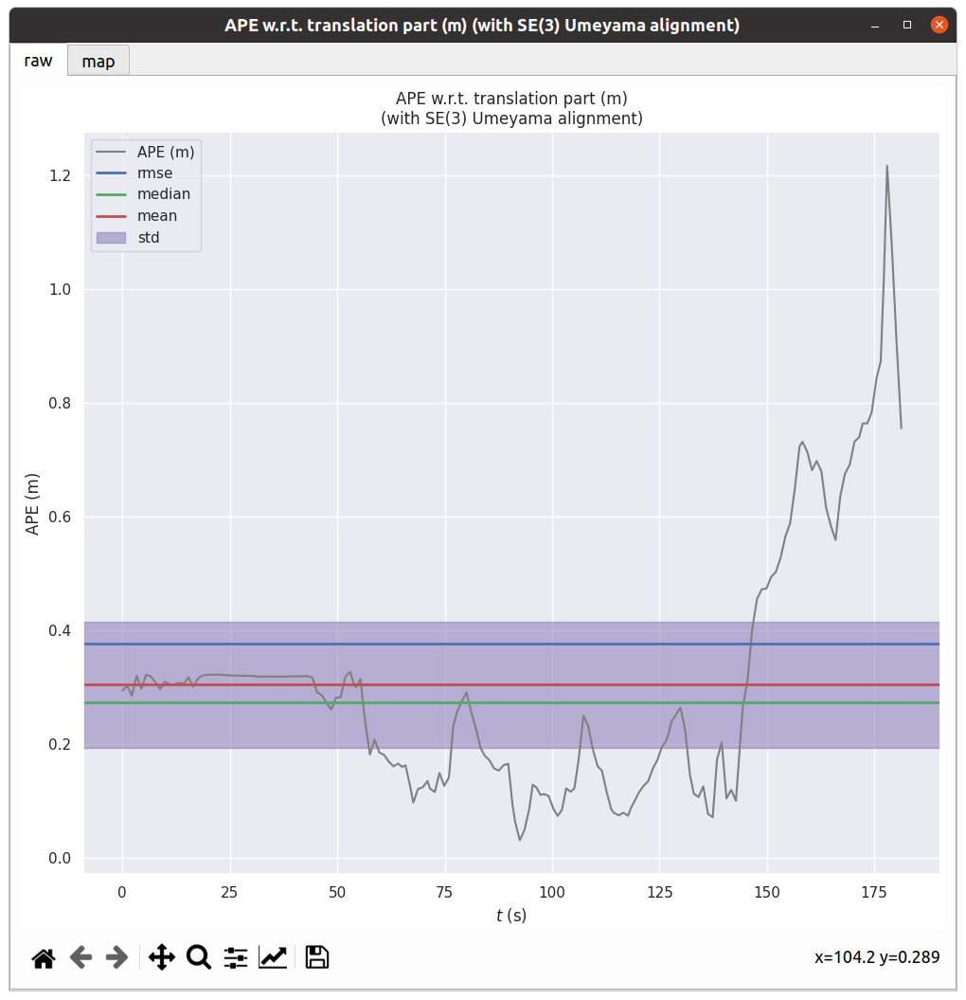
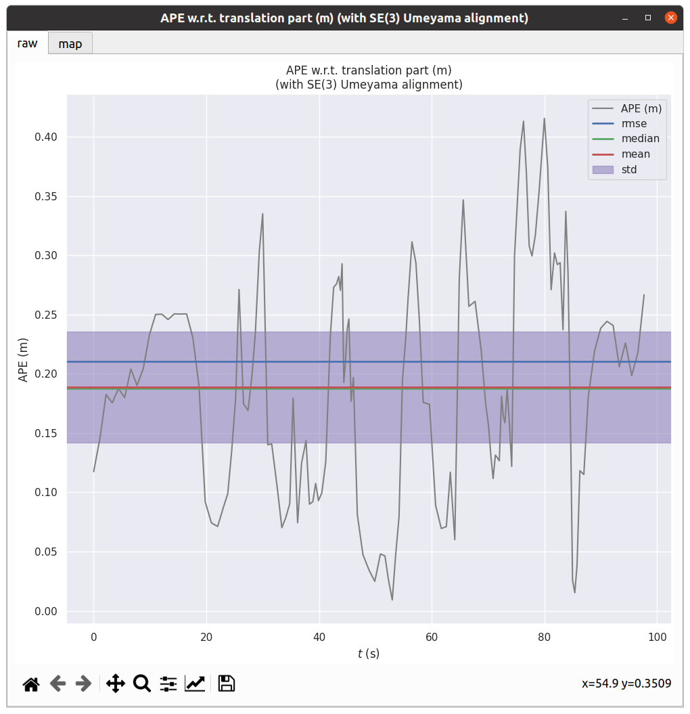
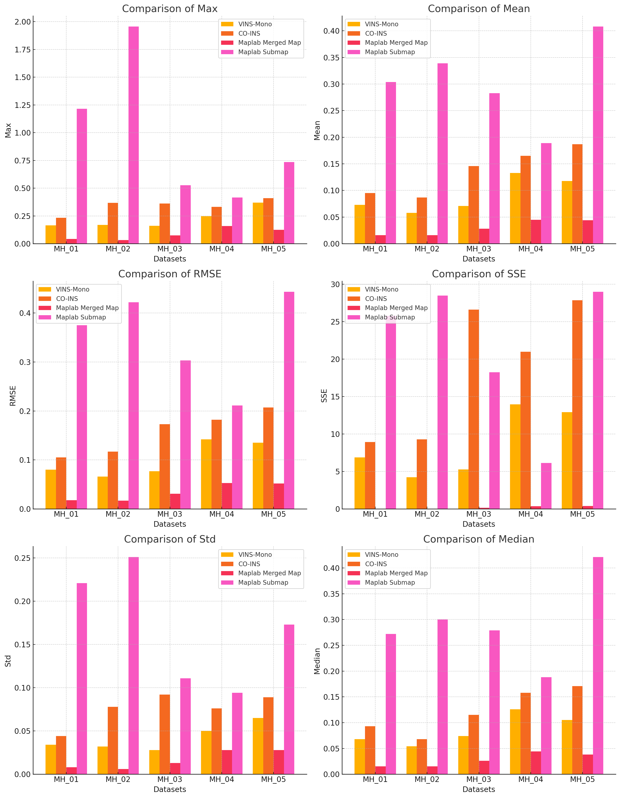

https://maplab.asl.ethz.ch/docs/master/index.html

## 安装

1. 按照官方教程安装ROS，这里我使用ROS noetic，对应的Ubuntu是20.04.
2. 如果没有安装catkin build tools，需要使用`apt`或其他软件包管理工具安装，以便可以使用`catkin build maplab`等命令，同时这个命令系列与`catkin_make`冲突，不能混用
3. 如果直接在maplab的工作目录进行build会发现许多依赖缺失，我们在maplab的文件目录下发现`.gitmodules`文件，里面写明了这个项目所需要的依赖项。（其实在git项目时加上`--recursive`选项就不会有这个问题了）
4. 我们在`./src/maplab`也就是maplab的源代码文件夹下使用`git submodule update --init --recursive`进行依赖项的安装。
5. 注意需要再次编译时使用`catkin clean`命令将原有编译缓存清除一下，防止中间文件对之后编译造成影响。
6. 使用`catkin build maplab`进行编译。


> I file included from /home/eureka/code/maplab/src/maplab/dependencies/3rdparty/libpointmatcher/pointmatcher/ICP.cpp:43:
> /home/eureka/code/maplab/src/maplab/dependencies/3rdparty/libpointmatcher/pointmatcher/MatchersImpl.h:41:10: fatal error: nabo/nabo.h: 没有那个文件或目录
>    41 | #include "nabo/nabo.h"
>       |          ^~~~~~~~~~~~~
>
> 
>
> Failed     << libpointmatcher:make                            [ Exited with code 2 ]
>Failed    <<< libpointmatcher                                 [ 17.5 seconds ] 
> Abandoned <<< maplab_console_full                             [ Unrelated job failed ]
>
> 
> 
> Errors     << maplab_common:make /home/eureka/code/maplab/logs/maplab_common/build.make.000.log
>[libprotobuf WARNING google/protobuf/compiler/parser.cc:562] No syntax specified for the proto file: maplab-common/eigen.proto. Please use 'syntax = "proto2";' or 'syntax = "proto3";' to specify a syntax version. (Defaulted to proto2 syntax.)


碰到一些问题，安装pointmatcher报错nabo/nabo.h: 没有那个文件或目录。

目前的解决方法是手动去dependencies/internal/libnabo中编译安装


> Errors     << maplab_common:make /home/eureka/code/maplab/logs/maplab_common/build.make.000.log
> [libprotobuf WARNING google/protobuf/compiler/parser.cc:562] No syntax specified for the proto file: maplab-common/eigen.proto. Please use 'syntax = "proto2";' or 'syntax = "proto3";' to specify a syntax version. (Defaulted to proto2 syntax.)
> [libprotobuf WARNING google/protobuf/compiler/parser.cc:562] No syntax specified for the proto file: maplab-common/eigen.proto. Please use 'syntax = "proto2";' or 'syntax = "proto3";' to specify a syntax version. (Defaulted to proto2 syntax.)
>
> 
>
> 
>
> /home/eureka/code/maplab/src/maplab/dependencies/internal/minkindr/minkindr/include/kindr/minimal/implementation/rotation-quaternion-inl.h:184:1: note: because ‘kindr::minimal::RotationQuaternionTemplate<double>’ has user-provided ‘kindr::minimal::RotationQuaternionTemplate<Scalar>& kindr::minimal::RotationQuaternionTemplate<Scalar>::operator=(const kindr::minimal::RotationQuaternionTemplate<Scalar>&) [with Scalar = double]’
>   184 | RotationQuaternionTemplate<Scalar>::operator=(
>       | ^~~~~~~~~~~~~~~~~~~~~~~~~~~~~~~~~~
> /usr/bin/ld: 找不到 -lreadline
> /usr/bin/ld: 找不到 -lreadline

这里安装`sudo apt-get install libreadline-dev`


> /home/eureka/code/maplab/src/maplab/dependencies/internal/ethzasl_apriltag2/src/example/apriltags_demo.cpp:53:10: fatal error: libv4l2.h: 没有那个文件或目录
>    53 | #include <libv4l2.h>

这里安装`libv4l-dev`

> error: ‘void* memcpy(void*, const void*, size_t)’ writing to an object of non-trivially copyable type ‘struct CvMat’; use copy-assignment or copy-initialization instead [-Werror=class-memaccess]

> /home/eureka/code/maplab/devel/include/opencv2/core/types_c.h:530:69: error: implicitly-declared ‘CvMat& CvMat::operator=(const CvMat&)’ is deprecated [-Werror=deprecated-copy]
>   530 |     *this = cvMat(m.rows, m.dims == 1 ? 1 : m.cols, m.type(), m.data);

解决方案是：
`catkin build maplab -DCMAKE_CXX_FLAGS="-Wno-error=class-memaccess -Wno-error=deprecated-copy"`忽视他们

总是卡死添加`-j10`选项，限制并行进程。

`catkin build maplab -j10 -DCMAKE_CXX_FLAGS="-Wno-error=class-memaccess -Wno-error=deprecated-copy"`

> eka/code/maplab/devel/lib/rovio/test_llu” 需求。 停止。
> make[2]: *** 正在等待未完成的任务....
> make[1]: *** [CMakeFiles/Makefile2:186：CMakeFiles/test_mlp.dir/all] 错误 2
> make[1]: *** 正在等待未完成的任务....
> make[2]: *** 没有规则可制作目标“gmock_main”，由“/home/eureka/code/maplab/devel/lib/rovio/test_patch” 需求。 停止。
> make[2]: *** 正在等待未完成的任务....
> make[1]: *** [CMakeFiles/Makefile2:2473：CMakeFiles/test_patch.dir/all] 错误 2
> make[1]: *** [CMakeFiles/Makefile2:1112：CMakeFiles/test_llu.dir/all] 错误 2
> make: *** [Makefile:141：all] 错误 2

安装`sudo apt-get install libgtest-dev libgmock-dev`

注意一定要`catkin clean`

终于装好了

## 使用

mapping 包可以工作在三种模式下，分别是

1. VIO建图（ROVIOLI in VIO mode）、
2. 基于地图定位（Localization mode）、
3. 多任务建图（Multi-session mapping with ROVIOLI）

### Maplab控制台使用

参考https://maplab.asl.ethz.ch/docs/master/pages/tutorials-maplab/basics/A_Basic-Console-Usage.html

#### 开启关闭

运行控制台

```bash
roscore & rosrun maplab_console maplab_console
```

退出控制台`q`or`exit`

#### 地图管理

地图的创建，加载，批加载，保存，批量保存，可视化

#### 基本命令

这里是进入控制台后的操作

1. `help`获取帮助
2. `flags`用`-`，查询可以直接tab ，也可以像这样`rosrun maplab_console maplab_console --help | grep -e "-lc_" -A 1`筛选，是因为maplab的控制台没有实现grep命令
3. 加载地图`load`，保存地图`save`，查看已加载的地图列表`ls`，地图数据查看`ms`即`map_statistics`。其他查看https://maplab.asl.ethz.ch/docs/master/pages/tutorials-maplab/basics/C_Console-map-management.html
4. 地图可视化`v`，在加载地图后使用，使用命令之后可以打开`rviz`查看相应的话题。
5. `lc`即loop closure，使用后可以在可视化界面查看相应话题，以及终端的输出信息。
6. `relax`去除一些偏差较大的回环边
7. 

### 实验一

参考https://maplab.asl.ethz.ch/docs/master/pages/tutorials-maplab-server/B_Euroc_Experiment.html

根据官网我们使用以下命令即可在Euroc的Machine Hall数据集上进行实验。

~~~bash
roslaunch maplab_server_node euroc-maplab-server-base-station.launch
roslaunch maplab_server_node euroc-maplab-server-robots.launch
~~~

结果如下：


使用以下命令保存地图。

~~~bash
rosservice call /maplab_server/save_map
~~~

地图保存在`/tmp/maplab_server/merged_map`.

#### server数据处理

1. 使用maplab的控制台加载地图
   ~~~bash
   load --map_folder output/maplab/maplab_server/merged_map/
   ~~~

2. 进行csv数据的导出
   ~~~bash
   csv_export --csv_export_path output/maplab/csv_data/merged_map
   ~~~

   TODO：此处遇到一个问题，在导出vertices.csv时，报错

   > F20250328 22:11:56.965234 16266 csv-export.cc:251] Check failed: it_vertex_id_to_index != vertex_id_to_index_map.end() 

   经过检测效果是只导出了MH_04_difficult数据集的轨迹路径。
   经过调查，使用命令`csv_export_vertices_only`可以成功导出

3. 进行数据格式的统一，这里我将估计的数据和benchmark的数据都统一为了tum的格式，并且需要将时间戳统一格式。

4. 使用evo工具进行比较
   ```bash
   evo_ape tum ~/output/vins/format_co_vins_gt/gt_co_04.txt ~/output/maplab/csv_data/merged_map/output.txt -va --plot --plot_mode xyz --save_results res.zip
   ```

1. mh01结果
   ```bash
          max	0.042506
         mean	0.015849
       median	0.015334
          min	0.003118
         rmse	0.017841
          sse	0.045200
          std	0.008193
   ```

   

2. mh02结果

   ```bash
          max	0.032134
         mean	0.015654
       median	0.015023
          min	0.004414
         rmse	0.016713
          sse	0.042180
          std	0.005855
   ```

   

3. mh03结果
   ```bash
          max	0.073851
         mean	0.027817
       median	0.026085
          min	0.006484
         rmse	0.030544
          sse	0.166063
          std	0.012615
   ```

   

4. mh04结果

   ```bash
          max	0.159330
         mean	0.044625
       median	0.043847
          min	0.005960
         rmse	0.052534
          sse	0.372580
          std	0.027721
   ```

   

5. mh05结果
   ~~~bash
          max	0.124460
         mean	0.044366
       median	0.037866
          min	0.003515
         rmse	0.052252
          sse	0.395889
          std	0.027602
   ~~~

   

6. conclusion

   （单位：米）：

   | Sequence  | Max   | Mean   | Median | Min    | RMSE   | SSE    | Std    |
   | --------- | ----- | ------ | ------ | ------ | ------ | ------ | ------ |
   | **MH_01** | 0.042 | 0.0158 | 0.0153 | 0.0031 | 0.0178 | 0.0452 | 0.0082 |
   | **MH_02** | 0.032 | 0.0157 | 0.0150 | 0.0044 | 0.0167 | 0.0422 | 0.0059 |
   | **MH_03** | 0.074 | 0.0278 | 0.0261 | 0.0065 | 0.0305 | 0.1661 | 0.0126 |
   | **MH_04** | 0.159 | 0.0446 | 0.0438 | 0.0060 | 0.0525 | 0.3726 | 0.0277 |
   | **MH_05** | 0.124 | 0.0444 | 0.0379 | 0.0035 | 0.0523 | 0.3959 | 0.0276 |

   可以看到，新模型的误差值相较之前显著减小，特别是在**最大误差（Max）**、**均方根误差（RMSE）**和**误差平方和（SSE）**方面表现更为优异。需要将这个模型的结果与之前的模型进行可视化对比吗？

#### node数据处理

鉴于merged_map不能导出所有的数据集的结果，我考虑导出了node上的子图，但是我发现每个node上的子图也是分开的，需要进行拼接，同时每个子图的最后一个数据和下一个子图的第一个数据是一样的（这一点在论文里可以看出）


为此我使用ai帮我写了脚本执行地图的提取和拼接，以及数据格式的修改。
~~~python
import os
import subprocess
import time
import pexpect
import pandas as pd
import numpy as np
import traceback

def source_maplab_setup():
    """
    Source maplab setup script
    """
    try:
        # 获取用户主目录的完整路径
        maplab_setup_path = os.path.expanduser('~/code/maplab/devel/setup.bash')
        
        # 使用bash -c 来source脚本并打印环境
        source_command = f'source {maplab_setup_path} && env'
        
        # 执行source命令并捕获输出
        proc = subprocess.Popen(['bash', '-c', source_command], stdout=subprocess.PIPE)
        
        # 解析环境变量
        for line in proc.stdout:
            line = line.decode('utf-8').strip()
            if '=' in line:
                key, value = line.split('=', 1)
                os.environ[key] = value
        
        print(f"成功source {maplab_setup_path}")
        return True
    except Exception as e:
        print(f"Source maplab setup脚本失败: {e}")
        return False

def start_roscore():
    """
    启动roscore
    """
    try:
        roscore_process = subprocess.Popen(['roscore'])
        # 给roscore一些启动时间
        time.sleep(3)
        return roscore_process
    except Exception as e:
        print(f"启动roscore失败: {e}")
        return None

def export_submaps_to_csv(maplab_node_path, csv_data_path):
    """
    使用maplab_console导出每个mh的子图为CSV文件
    
    :param maplab_node_path: maplab_node文件夹路径
    :param csv_data_path: csv_data文件夹路径
    """
    # 确保CSV数据目录存在
    os.makedirs(csv_data_path, exist_ok=True)

    # 遍历每个mh文件夹
    for mh_folder in sorted(os.listdir(maplab_node_path)):
        mh_path = os.path.join(maplab_node_path, mh_folder)
        
        # 确保是文件夹且不是资源文件夹
        if os.path.isdir(mh_path) and not mh_folder.endswith('_resource_folder'):
            # 创建对应的CSV输出文件夹
            mh_csv_path = os.path.join(csv_data_path, mh_folder)
            os.makedirs(mh_csv_path, exist_ok=True)
            
            # 遍历每个子图
            for submap_folder in sorted(os.listdir(mh_path)):
                if submap_folder.startswith('submap_'):
                    vi_map_path = os.path.join(mh_path, submap_folder)
                    csv_output_path = os.path.join(mh_csv_path, f'{submap_folder}')
                    
                    try:
                        # 启动maplab_console
                        child = pexpect.spawn('rosrun maplab_console maplab_console')
                        # 等待初始提示符
                        child.expect('$', timeout=10)
                        # 加载地图
                        child.sendline(f'load --map_folder {vi_map_path}')
                        
                        # 等待提示符变化（可能会是 maplab <submap_1>:/$）
                        child.expect(['$','maplab <.*>:/\$', 'maplab <>:/\$'], timeout=10)
                        
                        # 导出CSV
                        child.sendline(f'csv_export_vertices_only --csv_export_path {csv_output_path}')
                        child.expect(['$','maplab <.*>:/\$', 'maplab <>:/\$'], timeout=10)
                        
                        time.sleep(1)
                        # 退出
                        child.sendline('q')
                        # # 检查导出目录是否有文件
                        # exported_files = os.listdir(csv_output_path)
                        # print(f"导出的文件: {exported_files}")
                        
                        print(f"成功导出 {csv_output_path}")
                        
                    except pexpect.TIMEOUT:
                        print(f"导出 {vi_map_path} 超时")
                    except Exception as e:
                        print(f"导出 {vi_map_path} 失败: {e}")
                    finally:
                        try:
                            child.close()
                        except:
                            pass


def merge_csv_files(csv_data_path):
    """
    合并每个mh的子图CSV数据，先转换为TUM格式再拼接
    
    :param csv_data_path: csv_data文件夹路径
    """
    # 遍历每个mh文件夹
    for mh_folder in sorted(os.listdir(csv_data_path)):
        mh_path = os.path.join(csv_data_path, mh_folder)
        
        if os.path.isdir(mh_path) and mh_folder != 'merged_map' and mh_folder != 'test':
            # 获取所有子图文件夹
            submap_folders = sorted([f for f in os.listdir(mh_path) if f.startswith('submap_')])
            
            # 存储合并后的TUM格式数据
            merged_tum_data = []
            
            # 遍历子图文件夹
            for i, submap_folder in enumerate(submap_folders):
                submap_path = os.path.join(mh_path, submap_folder)
                
                # 找到内部的具体文件夹
                inner_folders = os.listdir(submap_path)
                for inner_folder in inner_folders:
                    csv_path = os.path.join(submap_path, inner_folder, 'vertices.csv')
                    
                    # 读取CSV文件并转换为TUM格式
                    if os.path.exists(csv_path):
                        # 读取输入数据，跳过标题行
                        data = np.loadtxt(csv_path, delimiter=',', skiprows=1)
                        
                        # 提取相关列
                        # 时间戳（第2列），从纳秒转换为秒
                        timestamps = data[:, 1] / 1e9
                        
                        # 位置（第3-5列）
                        positions = data[:, 2:5]
                        
                        # 四元数（第6-9列）
                        quaternions = data[:, 5:9]
                        
                        # 将TUM格式数据添加到列表中
                        for ts, pos, quat in zip(timestamps, positions, quaternions):
                            # 如果不是第一个子图或不是第一行，则添加
                            tum_line = f"{ts:.5f} {pos[0]:.5f} {pos[1]:.5f} {pos[2]:.5f} {quat[0]:.5f} {quat[1]:.5f} {quat[2]:.5f} {quat[3]:.5f}"
                            merged_tum_data.append(tum_line)
            
            # 保存最终的TUM格式文件
            output_path = os.path.join(csv_data_path, f'{mh_folder}_merged_tum.txt')
            with open(output_path, 'w') as f:
                for line in merged_tum_data:
                    f.write(line + "\n")
            
            print(f"成功合并并转换 {mh_folder} 的子图为TUM格式")

def main():
    # Source maplab setup脚本
    if not source_maplab_setup():
        print("无法source maplab setup脚本，退出")
        return
    
    # 启动roscore
    roscore_process = start_roscore()
    
    try:
        # 设置路径
        maplab_node_path = './maplab_node'
        csv_data_path = './csv_data'
        
        # 第一步：导出子图为CSV
        # export_submaps_to_csv(maplab_node_path, csv_data_path)
        
        # 第二步：合并CSV并转换为TUM格式
        merge_csv_files(csv_data_path)
    
    finally:
        # 关闭roscore
        if roscore_process:
            roscore_process.terminate()

if __name__ == '__main__':
    main()
~~~

1. MH_01_submap结果

~~~bash 
       max	1.216348
      mean	0.303653
    median	0.272103
       min	0.030315
      rmse	0.375487
       sse	25.801254
       std	0.220874
~~~



2. MH_02_submap结果

```bash
       max	1.955909
      mean	0.339293
    median	0.299541
       min	0.047198
      rmse	0.422030
       sse	28.497555
       std	0.250978
```


3. MH_03_submap结果

~~~bash
       max	0.526306
      mean	0.282603
    median	0.278905
       min	0.020572
      rmse	0.303494
       sse	18.237501
       std	0.110653
~~~


4. MH_04_submap结果

~~~bash
       max	0.415520
      mean	0.188684
    median	0.187624
       min	0.009182
      rmse	0.210728
       sse	6.128062
       std	0.093833
~~~



5. MH_05_submap结果

~~~bash
      max	0.734958
      mean	0.407577
    median	0.420995
       min	0.038187
      rmse	0.442622
       sse	28.995265
       std	0.172612
~~~


6. conclusion
   （单位：米）：

   | Sequence  | Max   | Mean   | Median | Min    | RMSE   | SSE     | Std    |
   | --------- | ----- | ------ | ------ | ------ | ------ | ------- | ------ |
   | **MH_01** | 1.216 | 0.3037 | 0.2721 | 0.0303 | 0.3755 | 25.8013 | 0.2209 |
   | **MH_02** | 1.956 | 0.3393 | 0.2995 | 0.0472 | 0.4220 | 28.4976 | 0.2510 |
   | **MH_03** | 0.526 | 0.2826 | 0.2789 | 0.0206 | 0.3035 | 18.2375 | 0.1107 |
   | **MH_04** | 0.416 | 0.1887 | 0.1876 | 0.0092 | 0.2107 | 6.1281  | 0.0938 |
   | **MH_05** | 0.735 | 0.4076 | 0.4210 | 0.0382 | 0.4426 | 28.9953 | 0.1726 |

   **最大误差（Max）\**和\**均方根误差（RMSE）\**明显较大，尤其是在\**MH_01**和**MH_02**。

### maplab与vins-mono与co-vins对比

为了直观比较四个算法（VINS-Mono、CO-INS、Maplab Merged Map、Maplab Submap）在**Euroc Machine Hall**五个数据集（MH_01到MH_05）上的表现，我采用**柱状图对比**

以下是可视化方案：

**柱状图对比：**

- **每个子图表示一个指标（Max、Mean、RMSE、SSE、Std、Median）。**
- **X轴：五个数据集（MH_01到MH_05）。**
- **Y轴：指标值。**
- **不同颜色代表不同算法。**



