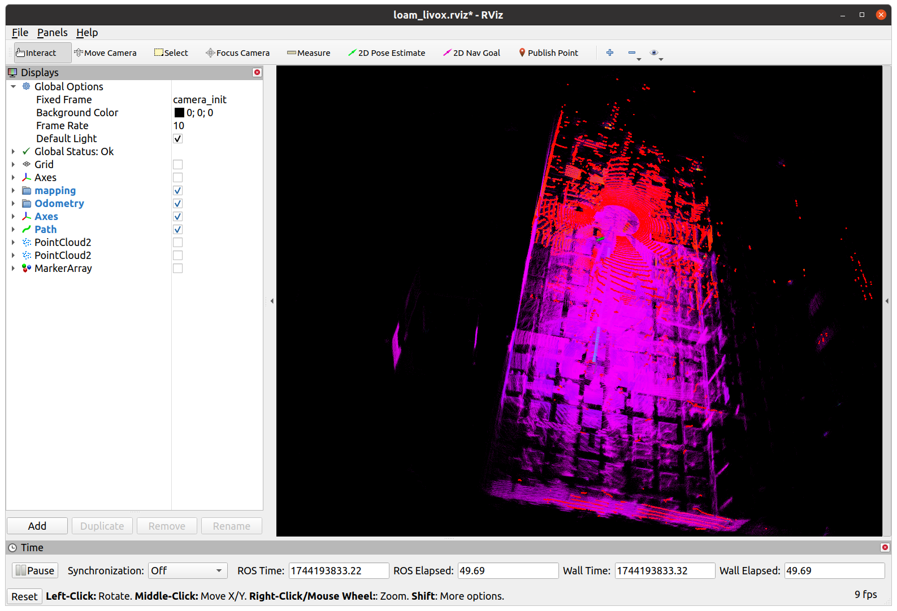

这个文档针对maplab以及fastlio2进行编写。配置fastlio2的前端集成到maplab进行使用。

参考https://github.com/ethz-asl/maplab/issues/389#issuecomment-1519134560

https://github.com/smauq/fast_lio/

## 安装过程

1. 首先按照Fast-Lio2的官方项目https://github.com/hku-mars/FAST_LIO的安装过程克隆和编译项目，这里我的ROS环境是noetic，不过没有编译冲突。

2. 按照https://github.com/ethz-asl/maplab/issues/389#issuecomment-1519134560的解决方案进行fastlio项目的修改，其实就是加上支持maplab的部分。或者就直接克隆https://github.com/smauq/fast_lio/这个作者修改过后的项目。

3. 播放数据集，这里我用的数据集是https://hilti-challenge.com/dataset-2021.html的IC-Office数据集。在播放之前先查看数据集的信息`rosbag info ~/bags/IC_Office_1.bag`，
   ```bash
   path:         /home/eureka/bags/IC_Office_1.bag
   version:      2.0
   duration:     3:20s (200s)
   start:        Aug 09 2021 16:56:12.15 (1628499372.15)
   end:          Aug 09 2021 16:59:32.57 (1628499572.57)
   size:         10.8 GB
   messages:     237826
   compression:  bz2 [12006/12006 chunks; 40.66%]
   uncompressed: 26.7 GB @ 136.2 MB/s
   compressed:   10.8 GB @  55.4 MB/s (40.66%)
   types:        livox_ros_driver/CustomMsg [e4d6829bdfe657cb6c21a746c86b21a6]
                 sensor_msgs/Image          [060021388200f6f0f447d0fcd9c64743]
                 sensor_msgs/Imu            [6a62c6daae103f4ff57a132d6f95cec2]
                 sensor_msgs/PointCloud2    [1158d486dd51d683ce2f1be655c3c181]
                 std_msgs/String            [992ce8a1687cec8c8bd883ec73ca41d1]
                 tf2_msgs/TFMessage         [94810edda583a504dfda3829e70d7eec]
   topics:       /alphasense/cam0/image_raw     2002 msgs    : sensor_msgs/Image         
                 /alphasense/cam1/image_raw     1995 msgs    : sensor_msgs/Image         
                 /alphasense/cam2/image_raw     2000 msgs    : sensor_msgs/Image         
                 /alphasense/cam3/image_raw     2002 msgs    : sensor_msgs/Image         
                 /alphasense/cam4/image_raw     2002 msgs    : sensor_msgs/Image         
                 /alphasense/imu               40024 msgs    : sensor_msgs/Imu           
                 /alphasense/imu_adis         163751 msgs    : sensor_msgs/Imu           
                 /livox/lidar                   2003 msgs    : livox_ros_driver/CustomMsg
                 /os_cloud_node/imu            20029 msgs    : sensor_msgs/Imu           
                 /os_cloud_node/points          2004 msgs    : sensor_msgs/PointCloud2   
                 /plt_measurement                 13 msgs    : std_msgs/String           
                 /tf_static                        1 msg     : tf2_msgs/TFMessage
   ```

   我们运行maplab后端用到的topic需要点云和imu信息需要用到`/alphasense/imu`和`/os_cloud_node/points`，最终播放用到的命令是`rosbag play ~/bags/IC_Office_1.bag /os_cloud_node/points:=/hesai/pandar`这里进行了一下话题映射。（这是我播放2021使用的，播放2022的直接播放就行）

4. 运行FastLio2前端，命令如下

   ```bash
   source ~/code/fastlio2_ws/devel/setup.bash 
   roslaunch fast_lio mapping_hesai.launch 
   ```

## FastLio2 前端运行效果

数据集是https://hilti-challenge.com/dataset-2021.html的IC-Office数据集


