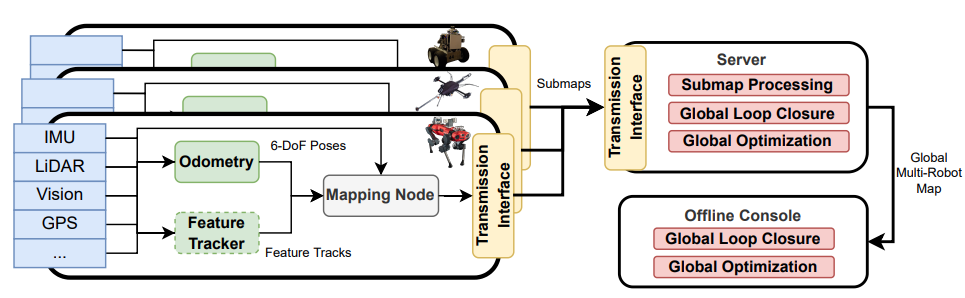

github:https://github.com/ethz-asl/maplab

paper:https://arxiv.org/pdf/2212.00654

https://maplab.asl.ethz.ch/docs/master/index.html

## Paper Notes

### Map Structure

#### 组成和约束

地图底层结构是点和边构成的因子图。

点(Vertices)：

1. robot在某一时刻的状态作为点（包括6自由度的位姿，速度以及IMU偏差）。
2. 路标点也可作为点（3D位置）：任何3D对象均可，包括视觉路标，3D路标以及语义对象等。

边(Edges):也就是点之间的约束

1. IMU边：包含预积分信息，仅在顺序点之间出现
2. 相对位姿限制边：包含6自由度的变换，用来代表移动或者回环。

边有一个协方差作为权重来评价测量的噪声。优化器会丢掉冲突过大的边。边最终用于计算估计位置和观察到的位置之间的误差。

#### Landmarks

**路标点**包括：

1. 基于ORB的特征（使用二进制描述符BRISK or FREAK）
2. 基于描述符匹配的特征关联（受到陀螺仪测量的限制）

然后被三角化为3D路标。

**全局定位和回环**：

1. 使用特征描述符构建2D-3D匹配
2. 共视检查用来过滤外点
3. 使用RANSAC模式的P3P，剩余的匹配被用来计算关于地图参考帧的变换（将被添加到因子图中作为回环边）
4. 另一种方法：合并共视路标点并最小化重投影误差

**不同类型的特征集成**：

1. LK跟踪光流法
2. 浮点数描述符，使用FLANN（最近邻）进行配准

**3D观察集成**：

可以处理RGB-D相机的数据或者是直接从3D点云侦测出的特征

不同点在于

1. 不是通过多视角三角化计算位置，而是平均3D测量来计算位置
2. 不是计算重投影误差，而是计算观察到的位置和路标位置的欧式距离
3. 回环使用的是3D-3D的RANSAC匹配，不是P3P算法

### Mapping Node

每个robot上都会运行一个建图节点。使用外部源以及raw传感器数据创建多模态的地图。6自由度里程计输入将首先用来初始化robot位姿。建图节点与里程计的方法和特征无关，并且有一个简单的接口，所以很容易进行替换，实现松耦合。

设计了自定义内部组件或者容易配置的外部接口来集成其他的传感器。1. 运行时可以合并任意数量的3D路标。2. 相对限制和绝对的6自由度限制可以无缝添加。

原始图像或者点云信息可以附加在地图中供后续使用。

### Mapping Server

建图服务器支持在线和协作建图。

1. 建图节点node将地图分块，传递子图到server，在server进行预处理和同node的子图连接。注意分割时将上一子图的最后一个节点复制到下一子图以保证连续性。
2. 同时server对不同robots的子图进行回环以构建全局一致的地图。

server和console共享代码库方便集成新特性。

#### 子图预处理

传⼊的⼦地图不会直接合并，⽽是先单独处理以确保局部准确。

单独处理：局部地图优化（full BA）、特征质量评估、地图内回环。（这个可以并行）

#### 多robot处理

进行第二组操作：回环、特征质量评估、BA、可视化、绝对约束异常值剔除等。

这里的回环算法在所有机器人间进行，多robot将被置于同一参考系并进行纠偏。

构建的全局一致的地图也将被传回robot以提高node的建图的准确性。

### Offline Console

可以轻松扩展：包括批量优化、合并来⾃不同会话的地图、异常值剔除、关键帧、地图稀疏化等。

使用激光雷达的回环也可以使用（配备了ICP和G-ICP）。

对不同的传感器和方法的结合，使用预定义的固定协方差。

密集重建使用Voxblox插件完成。

以及资源管理工具以及数据导出。