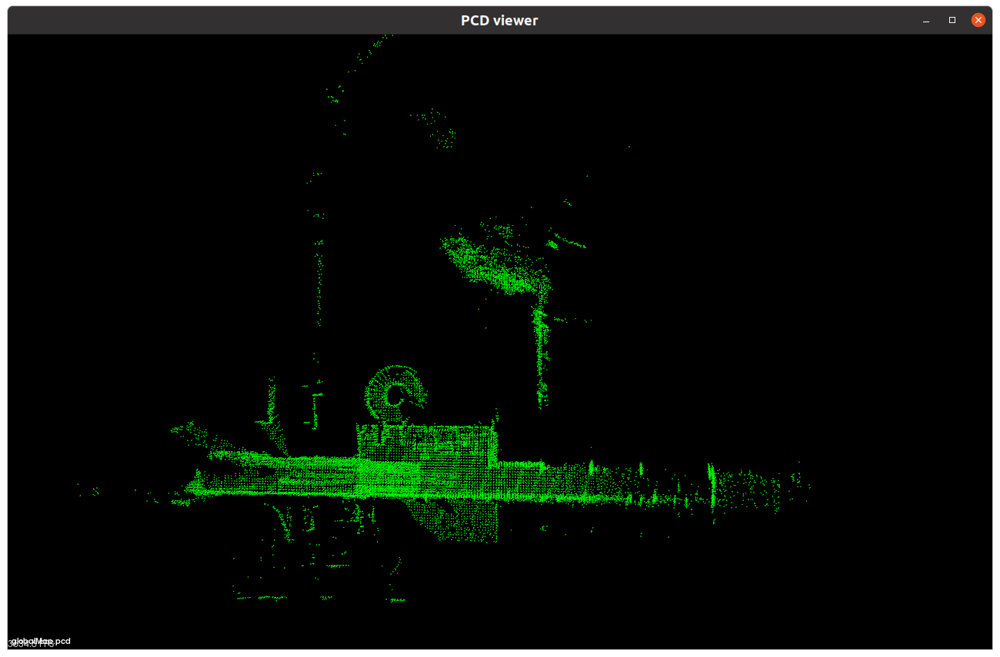

## 使用

### 运行

运行fastlio前端

```bash
source devel/setup.bash 
roslaunch fast_lio 3_robots.launch

roslaunch fast_lio robot_1.launch 
roslaunch fast_lio robot_2.launch 
roslaunch fast_lio robot_3.launch 

roslaunch aloam robot_1.launch
roslaunch aloam robot_2.launch
roslaunch aloam robot_3.launch
```

运行后端

~~~bash
source devel/setup.bash 
roslaunch global_manager global_manager.launch 
~~~

运行回环

~~~bash
source devel/setup.bash 
source ~/pyvenv/mr_slam_venv/bin/activate

python src/RING_ros/main_SC.py 
python src/RING_ros/main_RING.py 
python src/RING_ros/main_RINGplusplus.py 
~~~


播放自制数据集

~~~bash
cd /media/eureka/Solid\ Disk/datasets/bags/
~~~

~~~bash

rosbag play loop-30.bag /livox/imu:=/robot_2/imu /livox/lidar:=/robot_2/pointcloud --clock --pause -r 0.5
rosbag play loop-31.bag /livox/imu:=/robot_3/imu /livox/lidar:=/robot_3/pointcloud --clock --pause -r 0.5
~~~

~~~bash
rosbag play robot_1.bag /livox/imu:=/robot_1/imu /livox/lidar:=/robot_1/pointcloud --clock --pause -r 0.5
rosbag play robot_2.bag /livox/imu:=/robot_2/imu /livox/lidar:=/robot_2/pointcloud --clock --pause -r 0.5
rosbag play robot_3.bag /livox/imu:=/robot_3/imu /livox/lidar:=/robot_3/pointcloud --clock --pause -r 0.5

rosbag play robot_1.bag /livox/imu:=/robot_1/imu /livox/lidar:=/robot_1/pointcloud /livox/imu:=/robot_1/imu --clock --pause -r 0.5
rosbag play robot_2.bag /livox/imu:=/robot_2/imu /livox/lidar:=/robot_2/pointcloud /livox/imu:=/robot_2/imu --clock --pause -r 0.5
rosbag play robot_3.bag /livox/imu:=/robot_3/imu /livox/lidar:=/robot_3/pointcloud /livox/imu:=/robot_3/imu --clock --pause -r 0.5
~~~

~~~bash
rosbag play gazebo10.bag --clock --pause /velodyne_points:=/robot_1/pointcloud -r 0.5
rosbag play gazebo11.bag --clock --pause /velodyne_points:=/robot_2/pointcloud -r 0.5

rosbag play gazebo12.bag --clock --pause /velodyne_points:=/robot_1/pointcloud -r 0.5
rosbag play gazebo13.bag --clock --pause /velodyne_points:=/robot_2/pointcloud -r 0.5

rosbag play gazebo20.bag --clock --pause /velodyne_points:=/robot_1/pointcloud -r 0.5
rosbag play gazebo21.bag --clock --pause /velodyne_points:=/robot_2/pointcloud -r 0.5
rosbag play gazebo30.bag --clock --pause /velodyne_points:=/robot_3/pointcloud -r 0.5

rosbag play gazebo20.bag --clock --pause /velodyne_points:=/robot_1/pointcloud /imu:=/robot_1/imu
rosbag play gazebo21.bag --clock --pause /velodyne_points:=/robot_2/pointcloud /imu:=/robot_2/imu
rosbag play gazebo30.bag --clock --pause /velodyne_points:=/robot_3/pointcloud /imu:=/robot_3/imu
~~~


存储地图话题发布

~~~bash
rostopic pub /map_saving std_msgs/Bool "data: true" -1
~~~

### 检查

rviz中显示.pcd点云的方式

~~~bash
rosrun pcl_ros pcd_to_pointcloud <path_to_pcd_file> <interval> _frame_id:=<坐标系>
~~~

~~~bash
rosrun pcl_ros pcd_to_pointcloud globalMap.pcd 0.1 _frame_id:=map
~~~

pcl_viewer 查看点云

~~~bash
pcl_viewer <path_to_pcd_file>
~~~

### 评估

1. ground_truth 获取
   ~~~bash
   python bag2tum.py
   ~~~

   得到ground_truth.txt后移动到full_graph.g2o的位置
   ~~~bash
   cp ground_truth.txt ~/code/mr_slam/src/MR_SLAM/Mapping/src/global_manager/log/
   ~~~
   
   
   
2. 估计位姿转换为tum
   ~~~bash
   python g2o2tum.py
   ~~~

3. 估计位姿与ground_truth对齐
   ~~~bash
   python align_traj.py
   ~~~

4. evo评估
   ~~~bash
   # 使用odom作为参考的评估
   evo_ape tum ground_truth.txt estimated_aligned.txt --align --correct_scale --plot >> calc_res.txt
   ~~~

   

# 安装

所需要的库
Eigen (linear algebra library, tested on 3.2.9 & 3.3.4; elevation_mapping failed on 3.3.9)


[Cython](https://github.com/cython/cython) (C extensions for Python)
pip install cython


git clone https://github.com/borglab/gtsam.git -b 4.0.0-alpha2 && cd gtsam \
      && mkdir build && cd build && cmake .. && make install \


wget -O kindr.tar.gz https://github.com/ANYbotics/kindr/archive/refs/tags/1.2.0.tar.gz \
    && tar -xvzf kindr.tar.gz && cd kindr-1.2.0 && mkdir build && cd build \
    && cmake .. && make install -j8 


wget -O fftw.tar.gz http://fftw.org/fftw-3.3.10.tar.gz && tar -xvzf fftw.tar.gz \
    && cd fftw-3.3.10 && mkdir build && cd build && cmake .. \
    && make install -j8 

wget -O ceres.tar.gz https://github.com/ceres-solver/ceres-solver/archive/refs/tags/1.14.0.tar.gz && tar -xvzf ceres.tar.gz \
    && cd ceres-solver-1.14.0 && mkdir build && cd build && cmake .. \
    && make install -j8 
sudo apt install ros-$ROS_DISTRO-grid-map*
sudo apt install ros-$ROS_DISTRO-octomap*


git clone --recursive https://github.com/MaverickPeter/MR_SLAM.git
构建
cd Mapping && catkin_make -DBUILD_PYTHON_BINDINGS=ON
cd Localization && catkin_make


//增加回环检测
cd LoopDetection && catkin_make -DBUILD_PYTHON_BINDINGS=ON
cd fast_gicp python3 setup.py install --user
缺什么包pip3 安装即可 或者用conda也类似

//使用（ring ring++ disco）依赖cuda
安装cuda:11.1.1
pip3 config set global.index-url http://pypi.douban.com/simple
pip3 config set install.trusted-host pypi.douban.com

pip3 install torch==1.10.1+cu111 torchvision==0.11.2+cu111 torchaudio==0.10.1 -f https://download.pytorch.org/whl/cu111/torch_stable.html
pip3 install scipy open3d scikit-image alpha-transform

cd generate_bev_cython_binary && python3 setup.py install --user 或者加sudo
cd torch-radon && python3 setup.py install --user
 cd generate_bev_pointfeat_cython && python3 setup.py install --user 或者加sudo
cd LoopDetection/src/disco_ros/tools/multi-layer-polar-gpu/cython && python3 setup.py install --user 或者加sudo
//运行回环检测
rosrun disco_ros main.py（我目前报错 原因未知）

cd src/RING_ros
python main_SC.py

cd src/RING_ros
python main_RING.py

python main_RINGplusplus.py


## 安装Costmap

需要安装

~~~bash
sudo apt install ros-noetic-navigation
~~~


# 实验结果

## 1

数据集：mr_slam提供的数据集loop_22.bag,loop_30.bag,loop_31.bag

回环：ScanContext icp threshold=0.13

前端：fastlio2


数据集：mr_slam提供的数据集loop_22.bag,loop_30.bag,loop_31.bag

回环：RING++ icp threshold=0.15

前端：fastlio2


数据集：mr_slam提供的数据集loop_22.bag,loop_30.bag,loop_31.bag

回环：RING icp threshold=0.13

前端：fastlio2


## 2

数据集：mr_slam提供的数据集loop_22.bag,loop_30.bag,loop_31.bag

回环：ScanContext icp threshold=0.13

前端：aloam


数据集：mr_slam提供的数据集loop_22.bag,loop_30.bag,loop_31.bag

回环：RING++ icp threshold=0.15

前端：aloam


数据集：mr_slam提供的数据集loop_22.bag,loop_30.bag,loop_31.bag

回环：RING icp threshold=0.13

前端：aloam


数据集：mr_slam提供的数据集loop_22.bag,loop_30.bag,loop_31.bag

回环：RING++ icp threshold=0.2

前端：aloam


## 3 项目给定数据集

这个实验前端为fastlio，回环采用了RING

播放速度1.0 rate ICP阈值 0.4th


0.5rate 0.4 th


0.5 rate 0.2 th


0.5 rate 0.13 th


### 4 单机器人

robot_1.bag 0.5 rate submap_voxel_size=0.2 global_voxel_size=0.5

50s


100s


150s


robot_1.bag 0.5 rate submap_voxel_size=0.3 global_voxel_size=0.8

50s


100s


140s


robot_1.bag 0.5 rate submap_voxel_size=0.1 global_voxel_size=0.3

50s



100s


130s


### 5 两个机器人

robot_1.bag+robot_2.bag 0.5 rate 

submap_voxel_size=0.1 global_voxel_size=0.3 RING icp_th=0.13

filter_size_surf=1.0 filter_size_map=1.0

50s


100s


150s


200s


### 6 两个机器人

robot_1.bag+robot_3.bag 0.5 rate submap_voxel_size=0.1 global_voxel_size=0.3 RING icp_th=0.13

40s


100s


### 7 两个机器人

robot_2.bag+robot_3.bag 0.5 rate submap_voxel_size=0.1 global_voxel_size=0.3 RING icp_th=0.13

### 8 三机器人

robot_1.bag+robot_2.bag+robot_3.bag 0.5 rate submap_voxel_size=0.1 global_voxel_size=0.3 RING icp_th=0.13

50s


aloam前端


fastlio前端


## gazebo仿真


单机器人aloam前端


### 单机建图

前端aloam

gazebo21


gazebo20


gazebo30


### 多机建图：2个机器人

前端aloam 回环RING ICP接受阈值为0.13


前端aloam 回环RING++ ICP接受阈值为0.13


ICP接受阈值降低到0.08 以及0.05


前端aloam 回环ScanContext ICP接受阈值为0.13 ,以及ICP接受阈值调整为0.2和0.08


### 多机建图：3个机器人

前端aloam 回环RING


## 建图效果


### 评估结果

fastlio + gazebo20


fastlio + gazebo21


## costmap

fastlio前端的局部costmap效果


