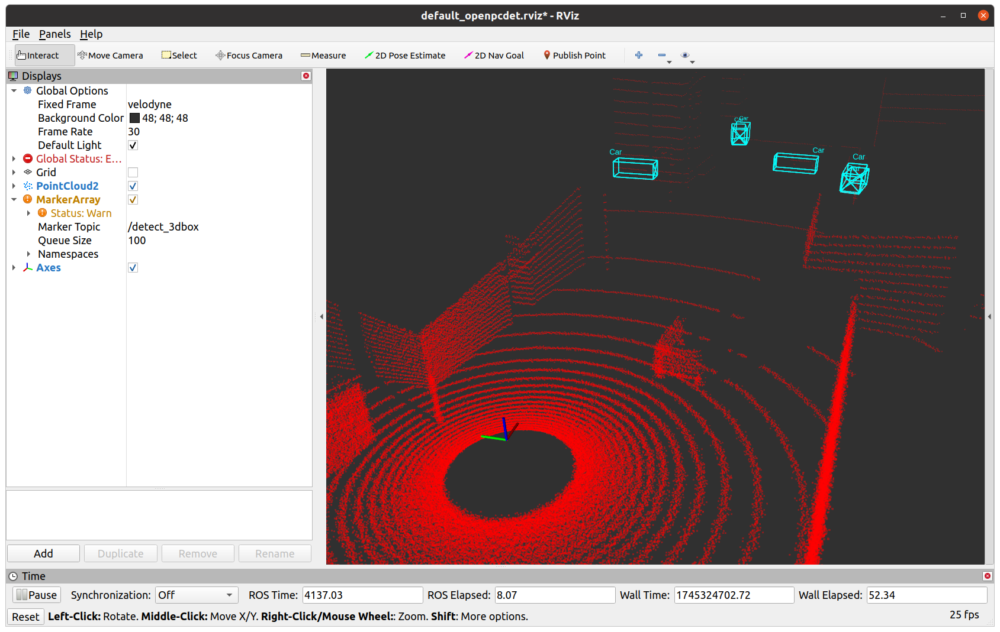
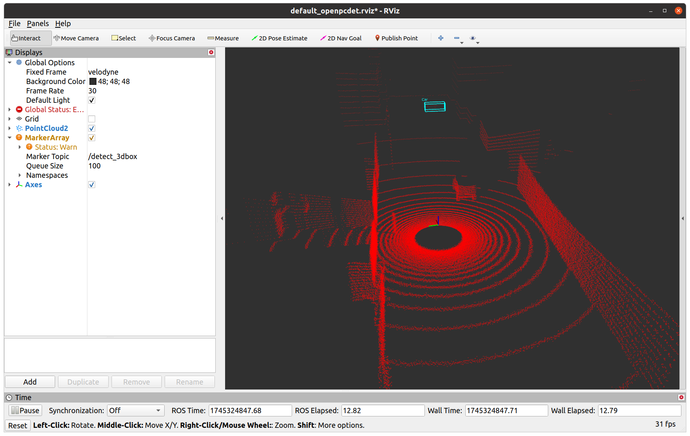

# 目标识别

OpenPCDet：一个开源的目标识别框架，集合了众多目标识别算法，包括PointPillars，PointRCNN，并且有相应的预训练模型，在此基础上将其与ROS进行结合。

官方项目地址：https://github.com/open-mmlab/OpenPCDet

ROS结合版本：https://github.com/Kin-Zhang/OpenPCDet_ros

数据集：KITTI：https://www.cvlibs.net/datasets/kitti/raw_data.php

> 使用KITTI数据集是raw模式，转换为bag数据播放需要使用官方提供的kitti2bag模块，使用pip install kitti2bag即可，参考https://blog.csdn.net/m0_45388819/article/details/108582312

以及我自行使用gazebo录制的数据

## 实验

模型：pv_rcnn_8369.pth 评分阈值：0.7

