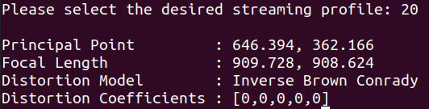

# 

参考：https://zhaoxuhui.top/blog/2020/09/09/intel-realsense-d435i-installation-and-use.html

https://www.intelrealsense.com/developers/

## 设备简介


设备：

1. 一个RGB-D相机（最右边那个）
2. 两个红外相机（左右分别一个）
3. 一个红外发射器（中间那个）
4. 一个IMU单元（D435后的i就是指imu）

深度成像原理：主动立体红外成像

## 安装

参考https://blog.csdn.net/wanghq2013/article/details/123325671

### SDK2.0安装

1. 注册服务器公钥并将服务器添加到软件存储库列表中

```bash
sudo apt-key adv --keyserver keyserver.ubuntu.com --recv-key F6E65AC044F831AC80A06380C8B3A55A6F3EFCDE || sudo apt-key adv --keyserver hkp://keyserver.ubuntu.com:80 --recv-key F6E65AC044F831AC80A06380C8B3A55A6F3EFCDE

sudo add-apt-repository "deb https://librealsense.intel.com/Debian/apt-repo $(lsb_release -cs) main" -u
```

2. 安装SDK2 Libraries

```bash
sudo apt install librealsense2-dkms
sudo apt install librealsense2-utils
```

3. 安装dev和debug工具

~~~bash
sudo apt install librealsense2-dev
sudo apt install librealsense2-dbg
~~~

### ROS接口安装

```bash
sudo apt install ros-noetic-realsense2-camera
sudo apt install ros-noetic-realsense2-description
```

安装rgbd-launch

```bash
sudo apt install ros-noetic-rgbd-launch
```

## 使用

参考https://zhaoxuhui.top/blog/2020/09/09/intel-realsense-d435i-installation-and-use.html

在插入D435i后屏幕翻转了180度。输入命令`xrandr -o normal` 恢复

### 简单使用

1. 终端输入下述命令进行简单使用

   ```bash
   realsense-viewer
   ```

   

### ROS 使用
ROS接口使用，输入以下命令：

~~~bash
roslaunch realsense2_camera rs_camera.launch 
~~~


### 内参获取

参考https://blog.csdn.net/m0_56182552/article/details/141352006

在没有其他进程占用相机的情况下，输入以下指令获取内参：
~~~bash
rs-sensor-control
~~~

1. 选择已经连接的相机
2. 选择相机对应的模块
3. 选择展示流内参
4. 选择对应选项的编号
   

5. 查看内参
   
