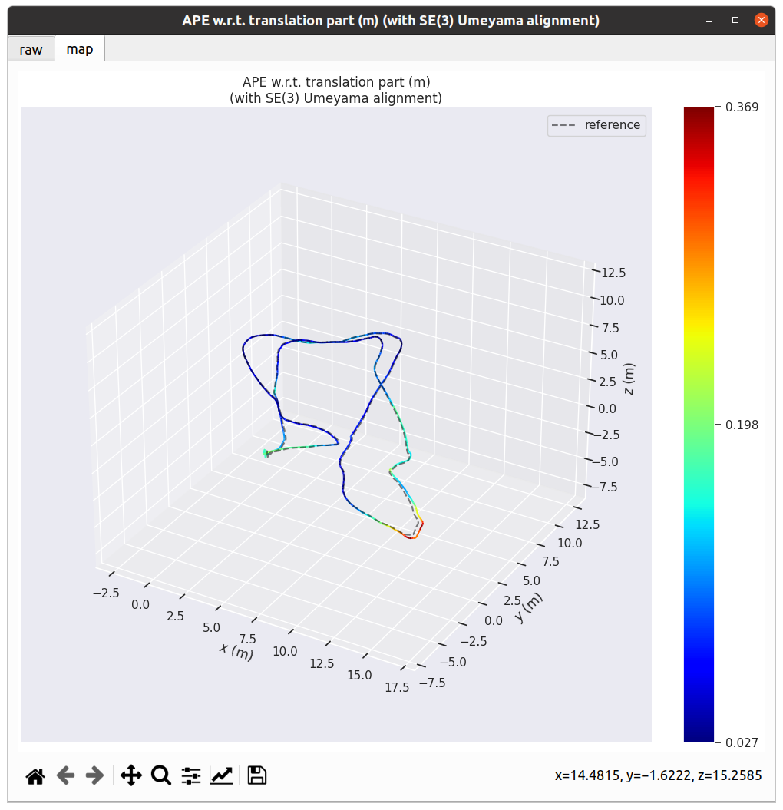
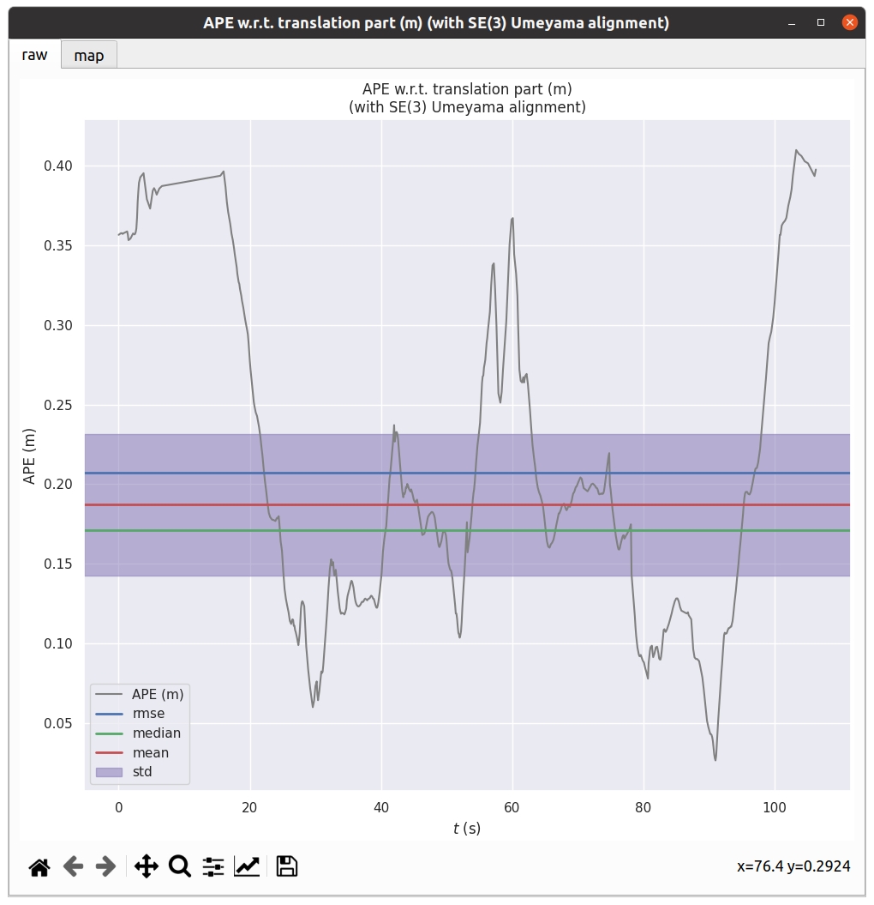

## Vins-mono

### 步骤

1. 构建`vins-mono`

2. 在打开的每个终端进行`source ${CATKIN_WS}/devel/setup.bash`
   ~~~bash
   source /home/eureka/catkin_ws/devel/setup.bash
   ~~~

3. 运行`vins_estimator`
   ~~~bash
   roslaunch vins_estimator euroc.launch
   ~~~


3. 运行rviz可视化
   ~~~bash
   roslaunch vins_estimator vins_rviz.launch
   ~~~

4. 打开`ground truth`的比较，以`MH_O1_easy`为例
   ```bash
   roslaunch benchmark_publisher publish.launch sequence_name:=MH_01_easy
   ```

5. 播放数据集
   ~~~bash
   rosbag play /home/eureka/bags/Euroc/MH_01_easy.bag
   ~~~

6. 保存`pose graph`
   在`vins_estimator`终端里输入`s`然后回车即可将`pose graph`保存至预定的位置

### 结果

MH_01_easy:


### 分析

#### Download EVO to analysis 

We can use EVO to analyze the ATE

~~~bash
pip install evo --upgrade --no-binary evo
~~~

#### Data format modification

> 格式
>
> - **TUM 格式**：`timestamp(秒) x y z qx qy qz qw`（8列，空格分隔）
> - **Euroc 格式**：`timestamp(纳秒) x y z qw qx qy qz vx vy vz bgx bgy bgz ...`（更多列，但 EVO 会自动提取前8列）
> - **KITTI 格式**：`4x4 位姿矩阵`（每行 12 列，空格分隔）

Refer to https://blog.csdn.net/xiaojinger_123/article/details/120141017 to change the source code of VINS-mono and rebuild.

1. modify standard data into tum format.

~~~bash
evo_traj euroc data.csv --save_as_tum
~~~

3. show the trajectory in EVO.

   ~~~bash
   evo_traj tum vins_result_loop.csv -p --plot_mode=xyz
   ~~~

   

   4. If we straight run the command in Step5, we will meet an error which is 
      ~~~bash
      [ERROR] found no matching timestamps between reference and vins_result_loop.csv with max. time diff 0.01 (s) and time offset 0.0 (s)
      ~~~

      I know that it is because of the difference of format of timestamps.
      So i use claude to generate a python script to change the format of the timestamps of the ground truth data below.

      ~~~python
      import numpy as np
      import os
      
      def convert_timestamp_format(input_file, output_file):
          """
          将data.tum文件中的时间戳格式转换为vins_result_loop.txt的格式
          data.tum格式: 1.403636580838555574e+09 x y z qx qy qz qw
          vins格式: 1403636582063555584 x y z qx qy qz qw
          """
          print(f"正在读取文件: {input_file}")
          
          # 检查输入文件是否存在
          if not os.path.exists(input_file):
              print(f"错误: 文件 {input_file} 不存在")
              return False
          
          converted_lines = []
          
          with open(input_file, 'r') as f:
              lines = f.readlines()
              
              for i, line in enumerate(lines):
                  # 跳过注释行或空行
                  if line.startswith('#') or not line.strip():
                      continue
                      
                  try:
                      # 分割行内容
                      parts = line.strip().split()
                      
                      if len(parts) < 8:  # 时间戳 + 位置(3) + 四元数(4)
                          print(f"警告: 第{i+1}行格式不正确: {line}")
                          continue
                      
                      # 提取时间戳并转换格式 (从秒转为纳秒整数)
                      timestamp_seconds = float(parts[0])
                      timestamp_nanoseconds = int(timestamp_seconds * 1e9)
                      
                      # 格式化其他数据，转换为更简单的浮点数表示
                      position_and_quaternion = []
                      for j in range(1, 8):
                          value = float(parts[j])
                          position_and_quaternion.append(f"{value:.5f}")  # 保留5位小数
                      
                      # 创建新行
                      new_line = f"{timestamp_nanoseconds} {' '.join(position_and_quaternion)}"
                      converted_lines.append(new_line)
                      
                  except Exception as e:
                      print(f"处理第{i+1}行时出错: {str(e)}")
          
          # 写入新文件
          with open(output_file, 'w') as f:
              f.write('\n'.join(converted_lines))
          
          print(f"转换完成，已保存到: {output_file}")
          print(f"处理了 {len(converted_lines)} 行数据")
          return True
      
      def check_timestamp_difference(vins_file, tum_file):
          """
          检查两个文件中时间戳的差异
          """
          print(f"比较时间戳差异...")
          
          # 读取vins文件时间戳
          vins_timestamps = []
          with open(vins_file, 'r') as f:
              for line in f:
                  if line.strip() and not line.startswith('#'):
                      parts = line.strip().split()
                      vins_timestamps.append(int(parts[0]))
          
          # 读取tum文件时间戳
          tum_timestamps = []
          with open(tum_file, 'r') as f:
              for line in f:
                  if line.strip() and not line.startswith('#'):
                      parts = line.strip().split()
                      tum_timestamps.append(float(parts[0]) * 1e9)
          
          # 计算统计信息
          if vins_timestamps and tum_timestamps:
              vins_avg = sum(vins_timestamps) / len(vins_timestamps)
              tum_avg = sum(tum_timestamps) / len(tum_timestamps)
              offset = vins_avg - tum_avg
              
              print(f"VINS平均时间戳: {vins_avg:.2f}")
              print(f"TUM平均时间戳: {tum_avg:.2f}")
              print(f"偏移量: {offset:.2f} ns (约 {offset/1e9:.6f} s)")
              
              return offset
          return 0
      
      def apply_offset_to_timestamps(input_file, output_file, offset, precision=5):
          """
          应用偏移量到时间戳并转换格式
          """
          print(f"应用 {offset/1e9:.6f} 秒的时间偏移...")
          
          converted_lines = []
          
          with open(input_file, 'r') as f:
              lines = f.readlines()
              
              for i, line in enumerate(lines):
                  if line.startswith('#') or not line.strip():
                      continue
                      
                  try:
                      parts = line.strip().split()
                      
                      if len(parts) < 8:
                          print(f"警告: 第{i+1}行格式不正确: {line}")
                          continue
                      
                      # 应用偏移量到时间戳
                      timestamp_seconds = float(parts[0])
                      adjusted_timestamp = timestamp_seconds * 1e9 + offset
                      timestamp_nanoseconds = int(adjusted_timestamp)
                      
                      # 格式化其他数据
                      position_and_quaternion = []
                      for j in range(1, 8):
                          value = float(parts[j])
                          position_and_quaternion.append(f"{value:.{precision}f}")
                      
                      # 创建新行
                      new_line = f"{timestamp_nanoseconds} {' '.join(position_and_quaternion)}"
                      converted_lines.append(new_line)
                      
                  except Exception as e:
                      print(f"处理第{i+1}行时出错: {str(e)}")
          
          # 写入新文件
          with open(output_file, 'w') as f:
              f.write('\n'.join(converted_lines))
          
          print(f"转换完成，已保存到: {output_file}")
          print(f"处理了 {len(converted_lines)} 行数据")
          return True
      
      if __name__ == "__main__":
          vins_file = "vins_result_loop.txt"
          tum_file = "data.tum"
          output_file = "data_vins_format.txt"
          
          # 检查两个文件是否存在
          if not os.path.exists(vins_file):
              print(f"警告: {vins_file} 不存在，将只进行格式转换")
              convert_timestamp_format(tum_file, output_file)
          else:
              # 检查时间戳差异并应用偏移
              offset = check_timestamp_difference(vins_file, tum_file)
              apply_offset_to_timestamps(tum_file, output_file, offset)
          
          print("\n您现在可以使用以下命令运行evo工具:")
          print(f"evo_traj tum {vins_file} --ref={output_file} -p --plot_mode=xyz --align --correct_scale")
      ~~~

      

   5. show the ground truth and estimated trajectory simultaneously 

      ~~~bash
      evo_traj tum vins_result_loop.csv --ref data.tum -a -p --plot_mode=xyz
      ~~~

      

5. Calc APE
   ~~~bash
   evo_ape tum data_vins_format.txt vins_result_loop.csv -va --plot --plot_mode xyz --save_results b.zip
   ~~~

   Results are:
   
   
   ~~~tex
   APE w.r.t. translation part (m)
   (with SE(3) Umeyama alignment)
   
          max	0.166354
         mean	0.072940
       median	0.067669
          min	0.010694
         rmse	0.080482
          sse	6.885351
          std	0.034015
   ~~~
   
   

## Other experiments

### MH_02_easy


~~~tex
APE w.r.t. translation part (m)
(with SE(3) Umeyama alignment)

       max	0.161940
      mean	0.071369
    median	0.073801
       min	0.012088
      rmse	0.076694
       sse	5.264427
       std	0.028081
~~~


### MH_03_medium


~~~tex
APE w.r.t. translation part (m)
(with SE(3) Umeyama alignment)

       max	0.169879
      mean	0.057886
    median	0.053542
       min	0.003518
      rmse	0.066310
       sse	4.243064
       std	0.032344
~~~


### MH_04_difficult


~~~tex
APE w.r.t. translation part (m)
(with SE(3) Umeyama alignment)

       max	0.247227
      mean	0.133060
    median	0.126389
       min	0.020221
      rmse	0.142267
       sse	13.965574
       std	0.050349
~~~


### MH_05_difficult


~~~tex
APE w.r.t. translation part (m)
(with SE(3) Umeyama alignment)

       max	0.369386
      mean	0.118465
    median	0.105230
       min	0.026758
      rmse	0.135203
       sse	12.923894
       std	0.065161

~~~



#### Without loops

~~~tex
APE w.r.t. translation part (m)
(with SE(3) Umeyama alignment)

       max	0.524205
      mean	0.323788
    median	0.308387
       min	0.138835
      rmse	0.330919
       sse	118.486897
       std	0.068329
~~~


### Conclusion

以下是MH_01到MH_05的绝对位置误差（APE）数据汇总（单位：米）：

| Sequence  | Max   | Mean   | Median | Min    | RMSE   | SSE     | Std    |
| --------- | ----- | ------ | ------ | ------ | ------ | ------- | ------ |
| **MH_01** | 0.166 | 0.0729 | 0.0677 | 0.0107 | 0.0805 | 6.8854  | 0.0340 |
| **MH_02** | 0.169 | 0.0579 | 0.0535 | 0.0035 | 0.0663 | 4.2431  | 0.0323 |
| **MH_03** | 0.161 | 0.0714 | 0.0738 | 0.0121 | 0.0767 | 5.2644  | 0.0281 |
| **MH_04** | 0.247 | 0.1331 | 0.1264 | 0.0202 | 0.1423 | 13.9656 | 0.0503 |
| **MH_05** | 0.369 | 0.1185 | 0.1052 | 0.0268 | 0.1352 | 12.9239 | 0.0652 |

### 实时测试

使用RealSense-D435i进行测试，相机相关配置请看文档。

参考https://blog.csdn.net/weixin_44580210/article/details/89789416

发现不能够成功在右侧得到轨迹，经过搜索发现是imu没开，参考https://blog.csdn.net/BHMPDTX/article/details/115219440

将rs_camera.launch中的
`  <arg name="enable_gyro"         default="true"/>

  <arg name="enable_accel"        default="true"/>`修改为true即可。
现在进行正式测试

```bash
roslaunch realsense2_camera rs_camera.launch 
roslaunch vins_estimator realsense_color.launch 
roslaunch vins_estimator vins_rviz.launch
```


## Co-vins

0. Refer the blog https://blog.csdn.net/xiaojinger_123/article/details/120141017
1. We need to add more agents in `./src/Co-VINS/vins_estimator/launch/euroc_multi_agent.launch`, which resimbles to the agent code previous.


2. Now I want calc the ATE of every trajectory. And I use Claude to generate a new script to modify the format of timestamps.
   ~~~python
   import numpy as np
   import os
   import sys
   import argparse
   
   def convert_ground_truth_format(input_file, output_file, precision=5):
       """
       将ground_truth文件中的时间戳格式转换为与新数据相匹配的格式
       ground_truth格式: 1.403638519492829323e+09 4.460675000000000168e+00 ...
       新数据格式: 1403638524.02783 -0.12141 0.20617 ...
       """
       print(f"正在读取文件: {input_file}")
       
       # 检查输入文件是否存在
       if not os.path.exists(input_file):
           print(f"错误: 文件 {input_file} 不存在")
           return False
       
       converted_lines = []
       
       with open(input_file, 'r') as f:
           lines = f.readlines()
           
           for i, line in enumerate(lines):
               # 跳过注释行或空行
               if line.startswith('#') or not line.strip():
                   continue
                   
               try:
                   # 分割行内容
                   parts = line.strip().split()
                   
                   if len(parts) < 8:  # 时间戳 + 位置(3) + 四元数(4)
                       print(f"警告: 第{i+1}行格式不正确: {line}")
                       continue
                   
                   # 提取时间戳并转换格式 (从科学计数法转为普通浮点数，保留5位小数)
                   timestamp_seconds = float(parts[0])
                   formatted_timestamp = f"{timestamp_seconds:.5f}"
                   
                   # 格式化其他数据
                   position_and_quaternion = []
                   for j in range(1, 8):
                       value = float(parts[j])
                       position_and_quaternion.append(f"{value:.{precision}f}")
                   
                   # 创建新行，使用空格分隔
                   new_line = f"{formatted_timestamp} {' '.join(position_and_quaternion)}"
                   converted_lines.append(new_line)
                   
               except Exception as e:
                   print(f"处理第{i+1}行时出错: {str(e)}")
       
       # 写入新文件
       with open(output_file, 'w') as f:
           f.write('\n'.join(converted_lines))
       
       print(f"转换完成，已保存到: {output_file}")
       print(f"处理了 {len(converted_lines)} 行数据")
       return True
   
   def check_timestamp_difference(new_data_file, ground_truth_file):
       """
       检查两个文件中时间戳的差异
       """
       print(f"比较时间戳差异...")
       
       # 读取新数据文件时间戳
       new_timestamps = []
       with open(new_data_file, 'r') as f:
           for line in f:
               if line.strip() and not line.startswith('#'):
                   parts = line.strip().split()
                   new_timestamps.append(float(parts[0]))
       
       # 读取ground_truth文件时间戳
       gt_timestamps = []
       with open(ground_truth_file, 'r') as f:
           for line in f:
               if line.strip() and not line.startswith('#'):
                   parts = line.strip().split()
                   # 从科学计数法转换为浮点数
                   gt_timestamps.append(float(parts[0]))
       
       # 计算统计信息
       if new_timestamps and gt_timestamps:
           new_avg = sum(new_timestamps) / len(new_timestamps)
           gt_avg = sum(gt_timestamps) / len(gt_timestamps)
           offset = new_avg - gt_avg
           
           print(f"新数据平均时间戳: {new_avg:.5f}")
           print(f"ground_truth平均时间戳: {gt_avg:.5f}")
           print(f"偏移量: {offset:.5f} s")
           
           return offset
       return 0
   
   def apply_offset_to_timestamps(input_file, output_file, offset, precision=5):
       """
       应用偏移量到时间戳并转换格式
       """
       print(f"应用 {offset:.5f} 秒的时间偏移...")
       
       converted_lines = []
       
       with open(input_file, 'r') as f:
           lines = f.readlines()
           
           for i, line in enumerate(lines):
               if line.startswith('#') or not line.strip():
                   continue
                   
               try:
                   parts = line.strip().split()
                   
                   if len(parts) < 8:
                       print(f"警告: 第{i+1}行格式不正确: {line}")
                       continue
                   
                   # 应用偏移量到时间戳
                   timestamp_seconds = float(parts[0])
                   adjusted_timestamp = timestamp_seconds + offset
                   formatted_timestamp = f"{adjusted_timestamp:.5f}"
                   
                   # 格式化其他数据
                   position_and_quaternion = []
                   for j in range(1, 8):
                       value = float(parts[j])
                       position_and_quaternion.append(f"{value:.{precision}f}")
                   
                   # 创建新行，使用空格分隔
                   new_line = f"{formatted_timestamp} {' '.join(position_and_quaternion)}"
                   converted_lines.append(new_line)
                   
               except Exception as e:
                   print(f"处理第{i+1}行时出错: {str(e)}")
       
       # 写入新文件
       with open(output_file, 'w') as f:
           f.write('\n'.join(converted_lines))
       
       print(f"转换完成，已保存到: {output_file}")
       print(f"处理了 {len(converted_lines)} 行数据")
       return True
   
   def parse_arguments():
       """解析命令行参数"""
       parser = argparse.ArgumentParser(description='转换时间戳格式以匹配不同数据集')
       
       parser.add_argument('new_data_file', help='新数据文件路径')
       parser.add_argument('ground_truth_file', help='ground_truth文件路径')
       parser.add_argument('output_file', help='输出文件路径')
       parser.add_argument('--precision', type=int, default=5, help='输出数值的小数精度 (默认: 5)')
       parser.add_argument('--apply-offset', action='store_true', help='应用时间戳偏移')
       parser.add_argument('--offset-threshold', type=float, default=0.01, 
                           help='自动应用偏移的阈值，单位秒 (默认: 0.01)')
       
       return parser.parse_args()
   
   if __name__ == "__main__":
       # 解析命令行参数
       args = parse_arguments()
       
       # 检查ground_truth文件是否存在
       if not os.path.exists(args.ground_truth_file):
           print(f"错误: {args.ground_truth_file} 不存在")
           sys.exit(1)
       
       # 转换ground_truth格式
       print("转换ground_truth文件格式...")
       convert_ground_truth_format(args.ground_truth_file, args.output_file, args.precision)
       
       # 如果新数据文件存在，检查时间偏移并应用
       if os.path.exists(args.new_data_file):
           offset = check_timestamp_difference(args.new_data_file, args.ground_truth_file)
           
           # 如果偏移量大于阈值，或者用户指定要应用偏移
           if abs(offset) > args.offset_threshold or args.apply_offset:
               offset_output = f"{os.path.splitext(args.output_file)[0]}_with_offset{os.path.splitext(args.output_file)[1]}"
               print(f"\n检测到时间偏移: {offset:.5f} 秒")
               print(f"创建应用偏移后的文件: {offset_output}")
               apply_offset_to_timestamps(args.ground_truth_file, offset_output, offset, args.precision)
               print("\n现在有两个转换后的文件:")
               print(f"1. {args.output_file} - 只进行了格式转换")
               print(f"2. {offset_output} - 应用了时间偏移")
       else:
           print(f"警告: {args.new_data_file} 不存在，只进行格式转换")
       
       print("\n处理完成!")
   ~~~

### Results

There are the ATE results of every route.

#### MH_01_easy

~~~tex
APE w.r.t. translation part (m)
(with SE(3) Umeyama alignment)

       max	0.233370
      mean	0.095414
    median	0.092837
       min	0.018256
      rmse	0.104879
       sse	8.942739
       std	0.043541
~~~


#### MH_02_easy

~~~tex
APE w.r.t. translation part (m)
(with SE(3) Umeyama alignment)

       max	0.367887
      mean	0.086885
    median	0.067655
       min	0.009424
      rmse	0.116627
       sse	9.303682
       std	0.077800
~~~


#### MH_03_medium

~~~bash
APE w.r.t. translation part (m)
(with SE(3) Umeyama alignment)

       max	0.361297
      mean	0.145971
    median	0.114961
       min	0.004881
      rmse	0.172745
       sse	26.617958
       std	0.092376
~~~


#### MH_04_difficult

~~~tex
APE w.r.t. translation part (m)
(with SE(3) Umeyama alignment)

       max	0.332258
      mean	0.165150
    median	0.158163
       min	0.011268
      rmse	0.181769
       sse	20.980310
       std	0.075929
~~~


#### MH_05_difficult

~~~tex
APE w.r.t. translation part (m)
(with SE(3) Umeyama alignment)

       max	0.409897
      mean	0.187060
    median	0.171061
       min	0.026490
      rmse	0.207255
       sse	27.877601
       std	0.089237
~~~



以下是MH_01到MH_05的绝对位置误差（APE）数据汇总（单位：米）：

| Sequence  | Max   | Mean   | Median | Min    | RMSE   | SSE     | Std    |
| --------- | ----- | ------ | ------ | ------ | ------ | ------- | ------ |
| **MH_01** | 0.233 | 0.0954 | 0.0928 | 0.0183 | 0.1049 | 8.9427  | 0.0435 |
| **MH_02** | 0.367 | 0.0869 | 0.0677 | 0.0094 | 0.1166 | 9.3037  | 0.0778 |
| **MH_03** | 0.361 | 0.1459 | 0.1149 | 0.0049 | 0.1727 | 26.6180 | 0.0924 |
| **MH_04** | 0.332 | 0.1652 | 0.1582 | 0.0113 | 0.1818 | 20.9803 | 0.0759 |
| **MH_05** | 0.409 | 0.1871 | 0.1711 | 0.0265 | 0.2073 | 27.8776 | 0.0892 |

这次的误差整体比上次大了一些，特别是在MH_03到MH_05上，最大误差和均方根误差（RMSE）都有所增加。


这是两个数据集的APE指标对比图，包括最大误差（Max）、平均误差（Mean）、均方根误差（RMSE）、误差平方和（SSE）、标准差（Std）和中位数（Median）。可以看到，第二批数据在多数指标上误差较大，特别是在MH_03到MH_05上。
